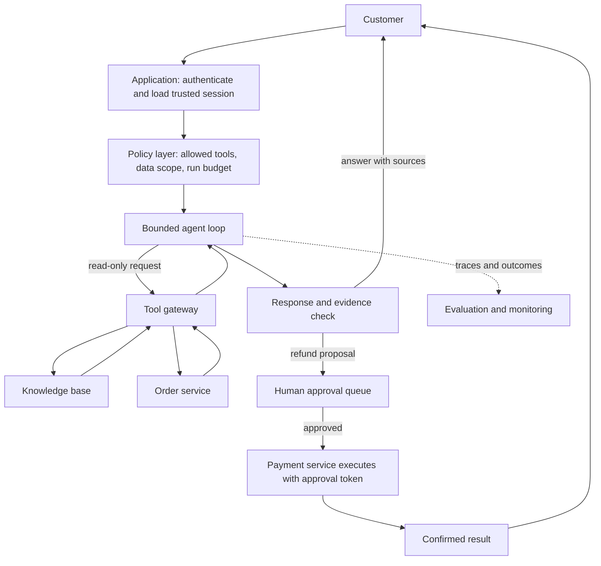

# Module 1 — Define the Agent’s Job and Boundaries

## The case we’ll build

We are designing a support-resolution assistant for an online store. It can answer policy questions, look up an authenticated customer’s order, and prepare a refund proposal. A human support operator must approve any refund before the payment system is changed.

This is a deliberately bounded training case. We can reason about real system design without connecting to customer accounts or payment systems.

## 1. Write the outcome before choosing the agent

**User need:** “Help me understand what happened to my order and what I can do about it.”

**Successful outcome:** The customer receives an accurate answer grounded in the current order record and the store’s policy. If a refund appears appropriate, the assistant prepares a proposal with the relevant facts, but no money moves until an authorized support operator approves it.

**Out of scope:** The assistant cannot change the customer’s identity, expose another customer’s data, make policy exceptions, issue money, or claim that an action completed when the backend has not confirmed it.

Notice the split: the model can help interpret a request and explain evidence. Identity, authorization, policy limits, and payment execution belong to ordinary application services.

## 2. Choose the smallest architecture that fits

This case has both predictable and variable parts. A policy lookup is a workflow: retrieve a policy, check that the answer is supported, and respond. A messy conversation that combines a delayed order, a missing item, and a refund question may need a model to decide which read-only lookup to do next. A **bounded single agent** can handle that flexible conversation while the backend keeps sensitive decisions deterministic.

We do not start with a team of agents. There is no independent work that needs parallelizing, and extra agents would add coordination and failure paths before we have evidence that they help.

The model chooses among permitted read operations and decides when it has enough evidence to respond. The tool gateway enforces access. A separate approval service authorizes a refund. The payment service returns the authoritative result.

## 3. Define the agent loop

For each model turn:

1. Give the model the user’s request, a small trusted session context, the current task state, and the tools it may use.
2. Let it either ask a clarifying question, request a read-only tool, draft a refund proposal, or answer.
3. Validate every proposed tool call against its schema and policy. The model’s text is not authorization.
4. Run an allowed tool, return its result as data, and let the model decide whether to continue.
5. Stop on a final answer, a human-approval boundary, a policy failure, or a hard run limit.

For the first version, cap the run at six model turns and a fixed time and token budget. A limit is not proof of correctness; it is a containment rule. If the limit is reached, the assistant should explain that it needs help and create a support handoff.

## 4. Sketch the tool contracts

| Tool | Model supplies | Runtime supplies | Effect | Key rule |
|---|---|---|---|---|
| `search_policy` | Search question | Approved knowledge-base connection | Read only | Return article IDs and excerpts; do not silently broaden the search scope. |
| `get_order` | Order reference | Authenticated customer ID from the session | Read only | Never accept a customer ID from the model; enforce ownership in the service. |
| `check_refund_eligibility` | Order reference | Authenticated customer ID and current policy version | Read only | Return only eligibility and policy version; do not create a proposal or request review. |
| `prepare_refund_proposal` | Order reference and customer-stated reason | Authenticated customer ID and current policy version | Draft write | Create a proposal for an explicit refund request; cannot charge, refund, or change order state. |
| `request_human_review` | Proposal ID and concise rationale | Trusted session and task ID | Creates a review request | Only an authorized operator can approve. |

There is intentionally no model-callable `issue_refund` tool. After operator approval, backend code invokes the payment service using a short-lived approval token. This design keeps model judgment separate from financial authority.

Tool outputs should be typed and bounded. For example, `get_order` should return only the fields needed for this task—status, item summary, dates, and fulfillment events—not a full customer profile.

## 5. State and trust boundaries

Keep durable task state in the application, not only in the conversation transcript. A minimal record could contain:

- Task ID, authenticated subject ID, and creation time.
- User request and any clarifications needed to finish it.
- Tool calls and results, with references to source records rather than unnecessary copies.
- Current stage: gathering facts, ready to answer, awaiting human review, completed, or handed off.
- Proposal ID and approval status if a refund is proposed.

Treat user messages, policy documents, order notes, and tool results as untrusted content. They may contain instructions that look authoritative; only the application policy grants capabilities. Keep secrets out of model context and redact personal data from traces unless there is a clear operational need and retention rule.

## 6. Make success measurable

Before optimizing the prompt or choosing a framework, create a small evaluation set. Include ordinary policy questions, valid order lookups, ambiguous requests, ineligible refund requests, malicious instructions embedded in an order note, and a payment-service failure.

For every run, record at least:

- **Task outcome:** Was the question answered or correctly handed off?
- **Evidence quality:** Are order facts and policy claims supported by returned records?
- **Tool behavior:** Was the right tool called with valid arguments and no excess data access?
- **Boundary compliance:** Was a refund left pending until a human approved it?
- **Operational cost:** Model turns, elapsed time, and estimated spend.

Track both final outcomes and the tool-call trajectory. A correct-looking answer can still hide an unauthorized lookup or an unapproved side effect.

## 7. Architecture review questions

Use these questions in a design review:

1. Could a fixed workflow handle the common case? If so, which requests truly need the agent loop?
2. Can a model-provided identifier ever select another customer’s record?
3. What is the authoritative signal that a refund completed?
4. What happens if the customer repeats the request while approval is pending?
5. Can the run be resumed after a timeout without repeating a side effect?
6. Which metrics would show that adding a second agent improves the system?

## Your design challenge

Pick one requirement above that you would change for a real product. Explain the consequence for the architecture and the evaluation set. For example, if operators approve refunds in a separate dashboard, decide how approval is bound to the exact proposal and how duplicate approvals are handled.

## Next module

We’ll turn these contracts into a working tool loop and inspect what the model can and cannot be trusted to do. The implementation will remain sandboxed, then we’ll add scenarios and measure behavior before discussing frameworks.

## Senior engineering extension: requirements before autonomy

Write a task taxonomy rather than one happy-path user story. For each class, capture volume, variability, harm from false completion, acceptable abstention/handoff, authoritative data, and whether a deterministic workflow covers it. Separate product outcomes (resolution, time saved) from model-facing proxies (phrase match, tool selection).

Create a one-page requirements table with an owner and verification method for each quality, safety, privacy, latency, availability, and budget requirement. Identify the minimum viable autonomy level for each task class. A system can use a workflow for the common path and a bounded planner for ambiguity; autonomy is often a routing decision, not a system-wide property.

Architecture review artifact: compare direct model call, fixed workflow, single-agent loop, and multi-agent orchestration on expected quality lift, failure surface, observability, cost per successful task, and rollback. State what measured result would reverse the chosen design.
