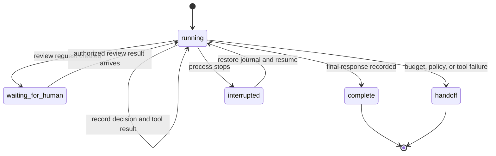

# Module 5 — Durable Runs, Retries, and Recovery

## Learning objective

Design a run so a process can stop and resume without losing the agent’s context, repeating a side effect, or changing who is authorized to act.

Anthropic’s managed-agent architecture describes a useful separation: a durable session log records what happened; a harness drives the model/tool loop; tools and sandboxes perform work behind their own interfaces. Their [case study](https://www.anthropic.com/engineering/managed-agents) is one design, not a requirement to use a hosted runtime. We implement the same separation locally with SQLite for learning.

## The run state machine



The `waiting_for_human` state is conceptually separate from an agent turn. In the teaching code, the tool result records a pending review and the agent may then answer that it is waiting. A real service should persist a task status that allows the worker to sleep until an operator decision arrives.

## What must survive a restart?

For one run, persist enough information to resume correctly:

- A run ID bound to the original authenticated subject and request.
- Every model decision that could trigger a tool call.
- Every tool result, including safe errors.
- The provider’s assistant tool-call content and tool-use ID, so the next Anthropic request has a valid transcript.
- Run status, turn count, budgets, final answer, and accumulated model metrics.
- Stable idempotency keys and results for internal writes.

The session journal should not contain API keys or reusable authentication tokens. In a production service, encrypt retained data, apply access controls and retention limits, and reacquire/validate the actor’s current authorization when resuming.

## Recovery rule: replay requests only when the operation is safe

A common crash window is:

```text
write tool request to journal
    ↓
tool performs its side effect
    ↓  process crashes here
write tool result to journal
```

After restart, the journal cannot tell whether the side effect completed unless the operation is idempotent or the downstream system can be queried. Do not blindly repeat an unknown non-idempotent write.

In this sandbox, reads are safe to repeat. Proposal creation and human-review enqueueing use stable keys and a SQLite uniqueness constraint. The store also rejects reuse of the same key for a different request. For a payment integration, use the payment provider’s idempotency mechanism and reconcile unknown outcomes before retrying. This project intentionally has no payment execution operation.

For more complex services, write the business state and an outbox event in one database transaction. A worker sends the external request from the outbox, uses an idempotency key, and records the confirmed result. An approval should be bound to the exact proposal version or digest, not to free-form text that could later refer to a different action.

## Hands-on implementation

The sandbox now includes:

- `SQLiteRunJournal`: records decisions and tool results, reconstructs Anthropic tool-call messages, and resumes unfinished runs.
- `SQLiteIdempotencyStore`: returns the same proposal/review result after restart and rejects an operation key reused with different request data.
- An optional `journal` argument on `AgentLoop.run`.
- Optional durable proposal/review storage on `ToolRuntime`.
- `run_durability_checks.py`: simulates crashes around tool execution and process restart.

Run:

```sh
python3 run_durability_checks.py
```

The five local checks cover recovery after a review write but before its result is journaled, completed-run replay without another planner call, conflicting idempotency-key reuse, subject binding, and restoration of Anthropic tool history and token metrics.

## What these checks establish—and what they do not

They establish that this SQLite teaching implementation can resume the tested serial scenarios and avoid a duplicate review item after the simulated crash. They do not establish multi-worker safety, process-level deployment reliability, secret storage, database backup/restore, external payment semantics, or production readiness.

The journal deliberately assumes one active worker per run. A production orchestrator needs a lease or robust compare-and-swap claim, plus cancellation and stale-lease recovery. This is an explicit limit in `durable_state.py`; the unique idempotency records protect writes, but they do not replace worker coordination.

## Design exercise

Imagine the review worker times out after asking a payment service to issue an approved refund, but before recording the response. Specify:

1. What persistent state marks the action as pending or unknown?
2. What idempotency key binds the retry to the exact approved proposal?
3. How does the worker distinguish “payment succeeded, response lost” from “payment never happened”?
4. What prevents an expired or edited approval from authorizing a different amount?
5. When should the system reconcile automatically, and when should it stop for a person?

## Senior engineering extension: distributed execution

Promote the single-worker journal into an explicit multi-worker state machine before horizontal scale. Define lease owner, expiry, heartbeat, monotonically increasing fencing token, optimistic state version, and compare-and-swap transition for each run. An expired worker must not append results or trigger a later transition after ownership changes. Use database constraints to enforce invariants under races; “check then insert” is not concurrency control.

Document the consistency model for reads, writes, and resumed runs. Decide whether resume reuses the exact recorded provider transcript, regenerates a decision, or fetches fresh evidence. Replaying a completed decision must not replay a side effect. Keep an explicit `outcome_unknown` state for external writes and reconcile with the downstream system using its idempotency key or authoritative operation lookup.

Add fault-injection cases for two workers claiming one run, lease expiry during a slow tool call, stale worker completion, duplicate queue delivery, old/new event schemas during deploy, cancellation in each state, database restore, and provider success with a lost acknowledgement. Measure recovery time and backlog. Use Module 12 to specify restore and reconciliation objectives.

## Next module

The approval and outbox lab is in [Module 6](agentic-ai-module-06-human-approval-outbox.md). Continue with the security threat model in [Module 7](agentic-ai-module-07-agent-security-threat-model.md), then carry the resulting requirements into a production architecture and operating plan.
