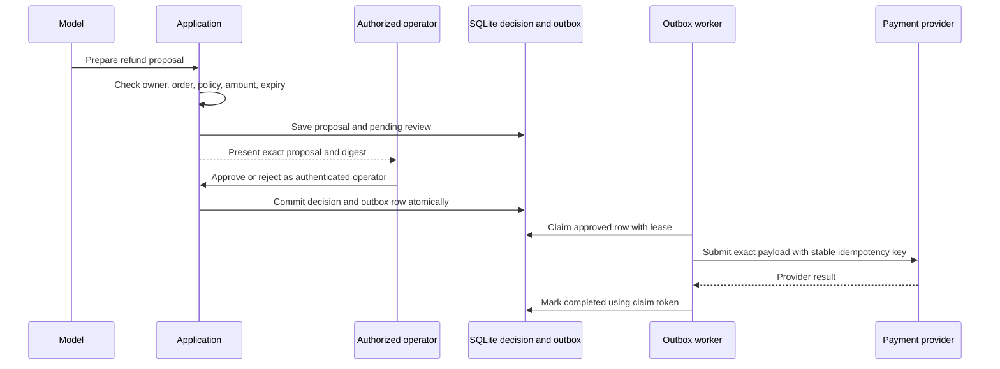

# Module 6 — Human Approval and Retry-Safe Actions

## Goal

Design a consequential action so the model can prepare a proposal and explain it, while only an authorized person can approve it and only a controlled worker can submit it. Make the approval apply to one exact action, and make retries safe after a worker or network failure.

This module uses the refund proposal in the support-agent sandbox. The payment provider is simulated and cannot move money.

## Why approval needs a system boundary

A prompt that says “ask a human before refunding” is not an authority boundary. The model could misunderstand, the transcript could be replayed, or a tool result could change. The application should enforce which actor may approve, which exact proposal is being approved, and which code is allowed to perform the side effect. Anthropic’s containment guidance also cautions that repeated permission prompts can cause approval fatigue, so reserve review for actions where a person meaningfully changes the risk decision; keep least-privilege controls in the runtime itself. See [Anthropic on containment and human review](https://www.anthropic.com/engineering/how-we-contain-claude) and [OWASP’s agentic application security guidance](https://genai.owasp.org/resource/owasp-top-10-for-agentic-applications-for-2026/).

## Flow



The model-facing tool list contains no approval or payment tool. The human approval path is a separate application operation. The approval digest covers proposal ID, task, owner, order, reason, amount, currency, policy version, and expiry. That makes an approval stale if any of those fields change between review and decision.

## What the sandbox implements

Open [the sandbox README](agentic-ai-sandbox/README.md) and run:

```sh
python3 run_approval_checks.py
```

`RefundApprovalOutbox` requires the proposal store and approval/outbox state to share one SQLite database. The approval transaction takes a write lock, checks the proposal's policy version and current owner/eligibility/amount/currency in `refund_authority_state`, then writes the decision and outbox row before committing. Current-state updates use the same transaction boundary, so an approval racing a policy/order update serializes: either approval commits against the old state first, or the update commits first and the stale approval is rejected. Repeating a committed approval returns its existing result. A unique proposal and idempotency key prevent duplicate records. A worker atomically claims pending work with a lease; a later worker may reclaim it after lease expiry. The provider mock stores its own idempotency ledger. If a worker crashes after provider success but before acknowledging the outbox, the restarted worker retries the same key and receives the same simulated refund result.

The verified local scenarios are:

1. The approval service refuses split databases that cannot provide the required transaction boundary.
2. The model has no approval tool; unauthorized and altered approvals do not enqueue work.
3. Approval binds to the exact proposal, and repeating the same approval creates one outbox action.
4. Only approved actions are claimable, and an unexpired lease blocks a second claim.
5. A retry after simulated provider success reuses the key and records one refund; an expired worker claim cannot complete the row.
6. An expired proposal cannot be approved.
7. A policy change or material order change before approval rejects the proposal and creates no outbox row.
8. A concurrent state update and approval serialize to one valid SQLite transaction order.
9. A rejected proposal cannot later be approved or sent to the provider.

## Design review: what remains outside this demonstration

- The operator allow-list is local application configuration, not authentication. A real approval endpoint must derive operator identity from a trusted identity system and enforce role and transaction limits on the server.
- The SQLite digest is a consistency check against a changed proposal. It is not a digital signature, does not prove what an operator saw, and cannot defend against an attacker who can rewrite the database and approval records.
- `refund_authority_state` is a synthetic current-state table colocated with the proposal, approval, and outbox rows so the transaction boundary can be exercised. A real deployment must use the authoritative policy/order datastore; if facts live in separate services, use a conditional revision/reservation API or a carefully designed saga because one SQL transaction cannot span independent systems.
- SQLite makes current-state validation, approval, and outbox insertion atomic in this local example. This does not prove multi-host database behavior. A distributed deployment still needs database ownership, worker claiming/leases, migrations, monitoring, and a dead-letter and reconciliation process.
- This demo treats a committed approval digest as valid authorization until proposal expiry, even if policy changes afterward. If the business rule requires policy to remain current at execution time, revalidate in the outbox worker and define how policy updates cancel or reconcile already-approved pending actions.
- The provider mock guarantees idempotency because it stores the key durably. A real payment provider must guarantee idempotency for the required retention window, or the system needs provider-side lookup/reconciliation before retrying an ambiguous result.
- This example does not collect a real user confirmation or execute a real refund. It demonstrates the state transition and recovery contract only.

## Your checkpoint

For a consequential action in a system you know, write down:

1. Which actor proposes it, which identity approves it, and which worker executes it?
2. Which immutable fields must the approval bind to? How long is it valid?
3. What happens if the worker crashes before the request, after the provider accepts, or before the local acknowledgement?
4. What idempotency or reconciliation guarantee does the external system provide?
5. Which actions truly need a human, and which can be constrained with a deterministic policy instead?

## Senior engineering extension: approval as a security protocol

An approval UI is part of the authorization boundary. The reviewer must see a canonical rendering of the exact fields covered by the proposal digest: subject, target, amount/units, reason, policy basis, side effects, expiry, and destination. Avoid approving a mutable pointer or free-form summary. Record the authenticated reviewer, role, decision, timestamp, displayed version, and any required second-person control.

Define separation of duties, reviewer limits, delegation, revocation, conflicts, expiry, and reapproval when a proposal changes. Protect against double-clicks, stale browser state, concurrent approvals, replay, and approval phishing. Use idempotent decision writes and compare-and-swap state transitions. Every queued action must trace to one approved digest and one stable execution key.

Measure approval queue age/abandonment, override/rejection rates, reviewer error, conflicting decisions, and reversals. High review volume can create fatigue; adjust eligibility or product policy rather than turning review into a rubber stamp. Drill an incident with an unapproved or wrongly scoped action and verify delivery can be paused independently from model operation.

## Further reading

- [Anthropic: Scaling Managed Agents — decoupling the brain from the hands](https://www.anthropic.com/engineering/managed-agents)
- [Anthropic: How we contain Claude across products](https://www.anthropic.com/engineering/how-we-contain-claude)
- [OWASP Top 10 for Agentic Applications](https://genai.owasp.org/resource/owasp-top-10-for-agentic-applications-for-2026/)
