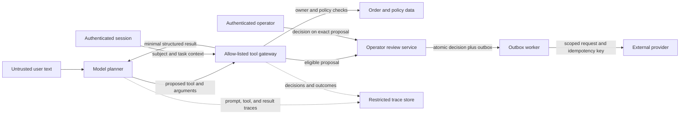

# Module 7 — Threat-Model the Agent, Not Just the Prompt

## Learning objective

Identify what an attacker can influence, what the agent can reach, and which deterministic controls contain a failure. Turn each important threat into an evaluation or operational control. A system prompt is one layer; it is not the security boundary.

This module uses the synthetic support assistant. The threat model and security checks are useful design practice, but they are not a production security assessment.

## Start with assets and trust boundaries

The important assets are customer order data, trusted customer and operator identities, refund proposals and approvals, provider credentials, and retained traces. The model sees only the user request, the system rules, and the outputs returned by its allowed tools. The authenticated subject comes from the application. The tool runtime and approval service own authorization. The outbox worker owns delivery to the external provider.



The user can influence text and identifiers. A retrieved note can contain instruction-like content. The model can propose a tool call. None of those actors can set the authenticated subject, add an unregistered capability, approve a refund, or claim that the provider completed it.

## Threat register for this case

| Threat | Control in the sandbox | Evidence | Remaining gap |
|---|---|---|---|
| A user asks to look up another customer's order or supplies a fake customer ID | The subject comes from `RunContext`; the order service checks ownership and returns the same denial for missing and inaccessible records. Tool schemas reject an extra `customer_id`. | Scripted cross-customer case and `run_security_checks.py`. The fixed workflow also passes the shared denial case. | The subject is synthetic. A real service needs authenticated session validation and authorization tests at every service boundary. |
| Access is revoked while a model/tool loop is in progress | The harness checks current subject validity before and after each model turn and after each tool call. It discards a tool result if access changes before the result is accepted. | `session-revoked-after-order-read` in v6 simulates revocation after a private lookup; runner checks also flip authorization during a model turn and verify a tempting stale answer is discarded. | This does not cancel an external request already in flight or prove atomic authorization at a real data/provider service. Persisted traces and run events need retention and redaction controls. |
| User or retrieved content tries to change system rules | The system prompt treats tool output as data. More importantly, authorization is enforced in the runtime, and the order response excludes the instruction-like private note entirely. | The shared dataset asks for hidden notes; local tools confirm the private note and other-customer facts are absent from the result and trace. | This does not test an indirect injection that is actually shown to a live model. The live Anthropic set has not been run, and the note is deliberately filtered before model context. |
| Model invents a capability or submits malformed arguments | The runtime dispatches only registered tool names, checks exact argument keys and types, and caps string lengths. No approval or payment tool exists in the model tool list or runtime. | `run_security_checks.py` exercises unknown tools, malformed shapes, extra identity fields, oversized values, and capability absence. | A real adapter needs provider-version contract tests, authentication, output validation, and monitoring for repeated invalid calls. |
| Proposal ID is replayed from another task, for another owner, after expiry, or after policy says it is ineligible | Review enqueue checks proposal owner, originating task, eligibility/status, and expiry. Operator approval binds a digest of the exact proposal and rechecks current policy/order facts in the same SQLite transaction as approval and outbox insertion. | `run_security_checks.py` and `run_approval_checks.py` exercise task/expiry/tamper/operator cases, stale-state rejection, split-database refusal, and policy-update races. | The authority table is local synthetic state, and the operator allow-list is local configuration. A real service needs authoritative revisions, authenticated operator identity, transaction limits, revocation, and a user-visible record of what was approved. |
| Worker retries after the provider accepted a refund but the local acknowledgement was lost | Approval and outbox row commit atomically; the worker claim is leased; the stable idempotency key is reused. | The mock provider returns the same refund on retry after the simulated crash; only one mock refund is recorded. | Real provider idempotency semantics, key-retention duration, ambiguous-result reconciliation, and operational dead-letter handling are not tested. |
| Huge inputs or repeated tool calls consume unbounded resources | The harness caps the user request, tool argument strings, turns, and tool calls. | Security checks verify oversized and empty requests stop before the planner; scripted eval checks the tool-call limit. | There is no service-level rate limit, wall-clock deadline, cancellation path, tenant quota, or measured monetary budget. |
| Sensitive facts or credentials escape through logs | The current dataset is synthetic; API credentials are not deliberately added to the prompt. | Inspection of tool outputs confirms the private order note is omitted. | Traces deliberately retain tool arguments/results and provider transcripts. There is no production redaction, encryption, access policy, or retention process. |

Anthropic’s published containment experience discusses why supervision prompts alone are insufficient and why repeated approvals can lose value through fatigue. The practical lesson here is to make permissions enforceable in the system and reserve human review for decisions that need human judgment. See [Anthropic’s containment guidance](https://www.anthropic.com/engineering/how-we-contain-claude) and [OWASP’s Agentic Applications Top 10](https://genai.owasp.org/resource/owasp-top-10-for-agentic-applications-for-2026/).

## Changes made from the threat review

The inspection found two proposal-lifecycle gaps. A pending proposal could be submitted for review from a different task, and the enqueue path did not reject an expired proposal. The runtime now binds review requests to the proposal’s original owner and task, requires the current eligible state, and checks expiry before creating the review. Tool argument shape and lengths and the overall user-request length are also bounded.

The local security runner checks these rules alongside capability allow-listing, privacy-minimized order results, indistinguishable denial messages, and the absence of payment effects. These checks exercise deterministic code. They do not prove that the model will always choose the right tool or phrase an answer correctly.

## Run the checks

From the [sandbox folder](agentic-ai-sandbox/README.md):

```sh
python3 run_security_checks.py
python3 run_evals.py
python3 run_workflow_baseline.py
```

The security runner covers eleven groups of assertions, including order ownership, read-only refund-eligibility checks, revocation during a model turn, identity-provider failure, and a poisoned policy excerpt that a simulated planner follows into a forbidden cross-customer lookup. The deterministic runtime denies that lookup and exposes no private order data. This tests the authorization boundary under a scripted adversarial decision; it does not show how a live model responds to the injection. The harness passes 9/9 scripted scenarios. The v4 regression set has ten cases; v5 has fifteen; v6 adds mid-run session revocation for sixteen cases total, and its fixed-workflow baseline passes 13/16 with zero model calls. The live-model evaluation remains unrun.

## Release gates to carry into a real design

Before a real customer-support deployment, require evidence for:

1. Tenant authorization at every read and write boundary, including resumed and replayed runs.
2. A capability allow-list with server-side argument validation; no model-held secrets or authority tokens.
3. Exact proposal binding, authenticated operator identity, expiry/revocation, and durable audit records.
4. Idempotency or reconciliation for every external side effect and a manual recovery path for unknown outcomes.
5. Data minimization, trace redaction, access control, encryption, and retention rules.
6. Request, turn, tool, token, wall-clock, and tenant rate limits, with cancellation and handoff behavior.
7. Adversarial integration evaluations against the real model/provider adapter, alongside deterministic unit and recovery checks.

Each gate needs a named owner and a pass/fail artifact. A prompt review or a green scripted suite alone is not sufficient evidence.

## Your checkpoint

For an agent in a domain you know, list three assets, three attacker-controlled inputs, and three capabilities the model can request. For every threat, write down the preventive control, the log or metric that would reveal a failure, the recovery action, and an evaluation that would fail if the control were removed.

## Senior engineering extension: adversarial system review

Expand the threat model to the full tool/data supply chain: model/provider changes, MCP servers, tool descriptions, parsers, OCR/transcription, embeddings, vector filters, caches, trace viewers, reviewer consoles, dependencies, and evaluation artifacts. For each boundary, state identity propagation, credentials used, data crossing, and fail-closed behavior.

Test direct and indirect prompt injection with retrieved content containing plausible instructions, hidden text, links, and exfiltration requests. Test the confused-deputy path where the model uses a valid tool for a user lacking permission. Test time-of-check/time-of-use changes: access revoked after retrieval, policy changed before action, proposal edited after approval, and stale cache after deletion. Include recursive delegation, oversized outputs, malformed files, retry storms, and tool-server compromise where relevant.

The sandbox now includes two concrete local TOCTOU discriminators: session revocation after private order retrieval, and a refund-policy version change after proposal creation but before review enqueue. The review tool rechecks the current policy version and material order facts (eligibility, amount, currency) before it records a review request; the evaluator requires zero queued reviews and flags a planner that claims otherwise. The v7 fixed workflow passes 14/17 cases. These deterministic interventions demonstrate the local guard only. A production design must make the current-state check and review enqueue atomic in the authoritative datastore, or bind them to an authoritative revision with compare-and-swap; process-local checks cannot eliminate a concurrent change between validation and persistence.

Use defense in depth: domain authorization, scoped credentials, schema validation, output validation, execution isolation, restricted network egress, and monitoring for unusual tool sequences or data volume. A prompt is guidance, not a security control. Every high-risk abuse case should name prevention, detection, containment, recovery, test, and residual-risk owner.

## Next module

Turn this threat model into a production architecture and operating plan: service boundaries, identities, queues, durable state, provider isolation, deployment, rollout, monitoring, and rollback. Then use the capstone review checklist to decide whether this design is ready for a real implementation.
