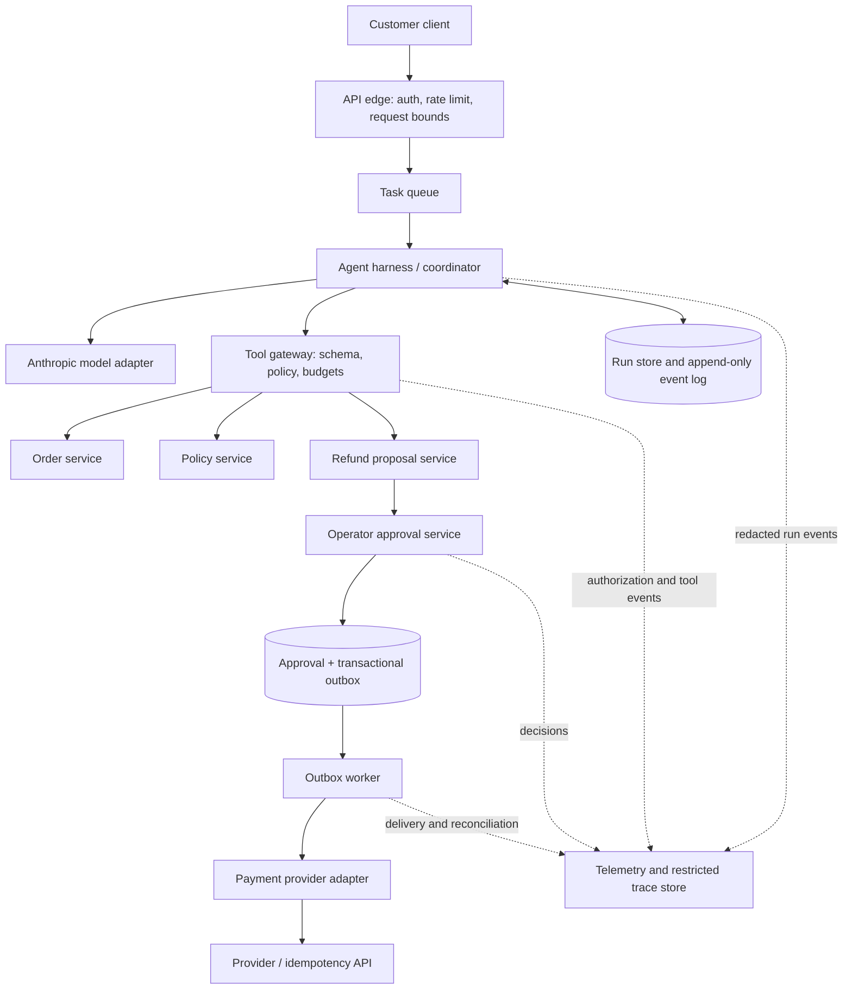
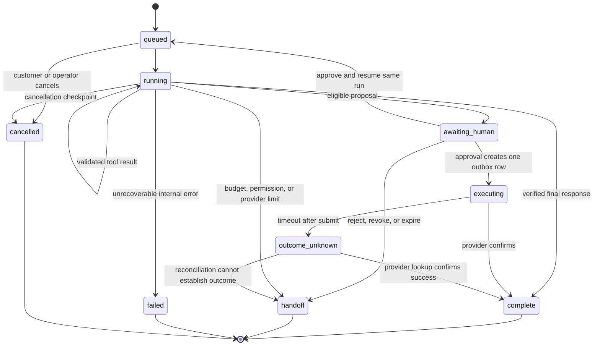

# Module 8 — Production Architecture and Operations Plan

Baseline revision note: numeric original-workflow results in this document are historical. Reproduce them with `--baseline original`. The improved router now passes 17/17 v7 authored cases with zero model calls; see [upgrade validation](agentic-ai-interview-upgrade-validation.md). The evaluated datasets and prior results were preserved.

## Learning objective

Turn the bounded support-agent prototype into an architecture another team could implement and operate. Keep the model, application control plane, data services, approval process, and external side effects behind separate interfaces. Define what the design must measure before it can claim production readiness.

This is a production design for review, not a deployed or load-tested service. The ten-case fixed-workflow baseline passes locally; live-model quality, traffic assumptions, latency targets, provider pricing, and the user's service-level requirements are still unknown.

## Recommended architecture

### Ownership by component

| Component | Owns | Must not own |
|---|---|---|
| API edge | User authentication, input limits, request ID, per-user rate limits | Model-selected identity or model API keys |
| Agent harness | Model requests, bounded turn loop, persisted run state, stop/handoff decisions | Order ownership or payment authorization |
| Tool gateway | Tool allow-list, schema validation, actor scope, per-tool budget, safe output shaping | Broad service credentials returned to the model |
| Domain services | Authoritative order ownership, policy version, proposal eligibility | Natural-language instructions as authorization |
| Approval service | Operator authentication/roles, exact action review, expiry/revocation, decision audit | Model-provided approval identity |
| Outbox worker | Lease claim, provider idempotency, retry/reconciliation | Reconstructing payment intent from free-form chat |
| Telemetry service | Redacted event metrics, traces under retention policy, incident evidence | Unfiltered long-term storage of all prompts and customer records |

Anthropic’s managed-agent architecture describes separating the durable session, the harness, and the tools/sandbox so they can fail or change independently. OpenAI’s current tracing and evaluation guidance similarly treats a full run trace as the unit for debugging and regression evaluation. These are useful design references, not requirements to use either vendor’s hosted runtime: [Anthropic managed agents](https://www.anthropic.com/engineering/managed-agents), [OpenAI trace evaluation](https://developers.openai.com/api/docs/guides/agent-evals), and [OpenAI tracing](https://developers.openai.com/api/docs/guides/agents-api/tracing).

## Durable state and async lifecycle

Persist a run ID, authenticated subject ID, request digest, prompt/tool/model versions, ordered model/tool events, current status, deadline, budgets, and terminal result. Encrypt stored data, separate sensitive payloads from operational metadata, and set different retention periods for each. Keep provider credentials in a secret manager or server-side proxy; the model context and tool result must never contain them.

The approval flow may resume the same agent run for a response, but payment execution is a separate backend operation. The model must not receive or invoke the payment credential. If the provider times out after receiving a request, mark the action `outcome_unknown`, query/reconcile by the original idempotency key, and do not issue a new key to “try again.” The SQLite lab now demonstrates local run leases, fencing, compare-and-swap journal writes, and heartbeat renewal during a slow simulated tool call. It does not establish provider/network failure behavior, same-run approval resume, cancellation, a distributed database, or provider reconciliation.

### Storage and worker rules

- Use a transactional relational store for runs, approval decisions, and the payment outbox. Commit a decision and its outbox event in one transaction.
- Use a queue for run and outbox wakeups, but assume at-least-once delivery. The database state and idempotency key decide whether work is new; queue delivery alone is not authority.
- Claim one active worker per run with a lease and fencing token. Renew leases during long calls; reject writes from an old token after ownership changes.
- Store a durable event before exposing a consequential state transition. Keep idempotency keys bound to a canonical action digest and a downstream request.
- Use expand/contract database migrations so the old application version can run during rollout and rollback.
- Apply cancellation at tool boundaries. If an external action is already in flight, cancellation moves the run to reconciliation; it does not claim the action was undone.

## Runtime limits and fallback

The prototype has six turns, four tool calls, an 8,000-character request cap, and bounded tool strings. Production limits should additionally include an end-to-end deadline, input/output token ceilings, per-user and per-tenant rate limits, concurrency quotas, tool-specific timeouts, and an explicit cancellation path. Record the limit that ended each run so operators can distinguish an expected handoff from a service failure.

Use a fixed workflow for known, structured requests. Route to the bounded model planner only when the request is mixed or unclear enough that dynamic sequencing is useful. The fixed workflow passes the ten-case v4 suite, 12/15 cases in v5, and 13/16 in v6 with zero model calls; v6 adds a session-revocation state transition. The original router missed multiple orders, multiple policy topics, and out-of-scope payment details. Those explicit branches now pass in the improved v7 baseline (17/17, zero model calls). This is a deliberate design gate: run both architectures on representative traffic before expanding model autonomy.

If the model provider is unavailable, return a clear handoff or use a deterministic workflow for intents whose correctness has been established. If the tool gateway or authorization service is unavailable, fail closed. If approval is unavailable, keep the request pending and tell the user; never infer approval from a timeout.

## Evaluation, metrics, and release gates

### Measure before setting service targets

The live Anthropic runner records model-turn count, input/output tokens, and model-call latency. It optionally estimates model-token cost from an explicit rate card; that estimate excludes tools, infrastructure and human work. It does not yet record tool timing, end-to-end queue delay, or human-review delay. Add those measurements before accepting a production latency/cost objective. Practice numerical sizing with the [worked capacity and cost exercise](agentic-ai-worked-capacity-and-cost.md).

Measure at least:

- Task outcome and handoff rate, split by intent and user segment.
- Tool choice, argument validity, denial correctness, and unauthorized data exposure.
- Human-review rate, wait time, rejection rate, stale/expired approval rate, and approval reversals.
- Provider request success, timeouts, duplicate deliveries, reconciliation time, and unknown-outcome backlog.
- p50/p95/p99 model-call time, tool time, queue time, and end-to-end task time.
- Input/output tokens and cost per completed task using the provider's current model rates.
- Limit hits, retry counts, repeated tool calls, and percentage of traces sampled for human review.

Set latency objectives from the product's response promise and measured p95 under expected concurrency. Set a spend envelope from the monthly budget divided by expected completed tasks, then enforce both a per-run token ceiling and tenant-level monthly quota. Do not invent these targets before obtaining the product SLA, model choice, provider rates, and traffic profile.

### Release sequence

1. **Pre-merge:** deterministic unit, security, adapter-contract, recovery, and approval/outbox checks pass. No critical authorization, privacy, or financial-action failure is acceptable.
2. **Offline model eval:** run the complete versioned set against the selected Anthropic model multiple times. Store provider/model version, prompt and tool versions, all tool events, grader outcomes, token usage, and latency. Calibrate phrase graders against human-reviewed traces.
3. **Shadow mode:** run model planning on sanitized representative requests without executing proposed writes; compare decisions to the fixed workflow and support-agent resolutions.
4. **Limited canary:** allow only read tools and proposal creation. Keep approval/payment isolated. Expand traffic only if safety invariants hold and p95 latency/cost remain inside approved limits.
5. **Action pilot:** enable operator review and outbox delivery only after identity, payment idempotency, reconciliation, audit, and on-call runbooks pass an operational exercise.

For each change, compare the same dataset and, when possible, the same traffic sample. A correct final answer does not erase an unsafe tool path. Treat any cross-tenant disclosure, unauthorized write, model access to a secret, or duplicate financial side effect as a release blocker.

## Monitoring and incident response

| Signal | Alert or response |
|---|---|
| Cross-tenant denial or authorization bypass suspected | Freeze affected tool path; preserve redacted trace and request IDs; verify identity propagation and authorization logs. |
| Any unapproved outbox row or unexpected provider action | Stop new action delivery; leave in-flight rows in a reconciliable state; page payments owner; query provider by original key before retry. |
| Growing `outcome_unknown` or dead-letter backlog | Pause new financial writes; reconcile oldest rows first; notify support operations and affected customers using confirmed state only. |
| Model/tool error, budget-hit, or handoff spike | Fall back to fixed workflow or human support; compare by prompt/model/tool version and review sampled traces. |
| PII or secret detected in traces | Restrict access, stop or redact the offending trace pipeline, invoke retention/deletion process, and rotate any exposed credential. |
| Approval queue age or rejection rate rises | Scale human review capacity or narrow which requests enter review; do not auto-approve to clear the queue. |

On-call ownership should be explicit for the model adapter, tool gateway, order/policy services, approval queue, payment reconciliation, and privacy/trace store. Every alert needs a runbook, a safe degradation action, and a named human escalation path.

## Rollout and rollback

- Version the system prompt, model alias, tool schemas, policy version, dataset, and grader. Attach all version IDs to each run.
- Roll out model or prompt changes behind a feature flag. Keep the prior version available and route known intents to the fixed workflow when the new planner is disabled.
- Pause new proposal creation or outbox delivery independently. For an in-flight provider request, reconcile before retrying or declaring failure.
- Roll back application code without dropping additive database fields. Avoid destructive schema changes until old workers and queued events have drained.
- Keep a kill switch for model calls and a separate kill switch for consequential outbox delivery. A model-provider outage must not disable read-only deterministic support if that path remains safe.

## Capstone readiness review

| Requirement | Current evidence | Status |
|---|---|---|
| Bounded tool surface, ownership check, limited outputs | Runtime code and scripted/security checks | Demonstrated on synthetic data |
| Anthropic/Python adapter protocol | Fake-client tool round-trip and durable transcript recovery | Adapter mechanics demonstrated; live behavior unverified |
| Evaluation against a fixed baseline | Improved v7 workflow passes 17/17; original v7 passes 14/17; no live-model comparison | Incomplete for model value/quality |
| Policy retrieval quality | 11-query synthetic retrieval eval scores 100% exact coverage | Catalog is tiny and authored; representative corpus quality is unverified |
| Restart, retry, and local worker coordination | SQLite run journal/outbox; restart, two-thread claim race, stale fencing/state-version rejection, slow-tool heartbeat and heartbeat-loss recovery checks | Demonstrated on one local SQLite database; provider/network and multi-host behavior unverified |
| Human approval and action binding | Exact digest, allow-list, expiry, outbox checks | Local simulation; real operator authentication missing |
| Production identity, scale, deployment, and operations | Architecture and runbooks in this module | Design only; not implemented or load-tested |
| Privacy controls and cost/latency envelope | Threat register and metrics plan | Production retention, redaction, live rates, and SLO targets missing |

The design is ready for implementation review, not a production launch. The minimum next evidence is an actual multi-trial Anthropic evaluation, a human review of traces, agreed service/traffic/budget targets, and integration tests for the real identity and payment providers.

## Your checkpoint

Before calling an agent design production-ready, complete these with real values from its owner:

1. Expected average and peak task volume, concurrency, and task mix.
2. User-visible latency promise, monthly model budget, and per-run spend cap.
3. Which request classes must stay deterministic and which may enter the model loop.
4. Named on-call owners and runbooks for provider failure, unknown payment result, privacy incident, and rollback.
5. Release-blocking evaluation failures and the exact evidence required to lift each block.

This closes the eight-module core sequence. Supplemental Modules 9 and 10 cover orchestration and context/retrieval/memory in more depth. Practical mastery still requires applying the design to a real domain, running the live model evaluations, reviewing failures, and revising the architecture from measured evidence.

## Senior engineering extension: capacity, SLOs, and operational readiness

Extend the qualitative plan into a capacity worksheet when owners provide workload assumptions. Model task arrival rate, concurrent runs, model turns per run, tool fan-out, average and tail duration, token distributions, queue wait, retry amplification, retrieval load, and reviewer throughput. Size provider and worker concurrency separately; provider rate limits may be the bottleneck while application CPU is idle.

Define separate SLIs for request acceptance, safe useful response, correct handoff, retrieval freshness, authorized tool success, approval completion, and confirmed external action. Set SLO windows and error budgets with product and risk owners. API uptime alone does not imply useful task completion. Alert on burn rate and user-impacting backlogs instead of every isolated model error.

Build cost from measured route/task distributions, cache reads and writes, and retry tails. Enforce hard run budgets and tenant quotas in code. Simulate price changes, cache-miss surges, slow provider, long contexts, traffic spikes, and review-queue backlog. Verify that backpressure preserves safe reads and routes users clearly when capacity is exhausted.

Run a game day for provider outage, retrieval outage, identity failure, duplicate outbox delivery, unknown external outcome, poisoned knowledge source, and sensitive trace exposure. Each drill needs a detection signal, kill switch, runbook, evidence capture, recovery owner, and post-incident regression case. Practice database restore and index rebuild. Update the readiness table with results; architecture diagrams alone are not operational evidence.
