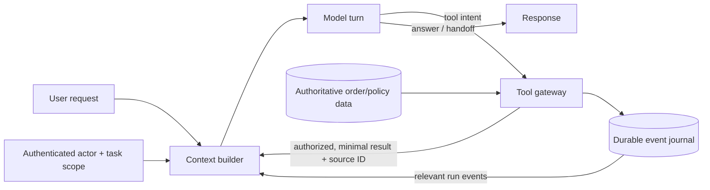

# Module 10 — Context, Retrieval, and Memory

## Learning objective

Decide what the model should see on this turn, how evidence is retrieved, what state must survive a restart, and what should never become long-term memory. Treat context as a curated view over authoritative state, not as the database itself.

Anthropic frames context engineering as choosing the configuration of information most likely to produce the desired behavior under a finite token budget. Its recent agent guidance also emphasizes just-in-time retrieval: keep lightweight references in state and load the needed data with tools when the task requires it. See [Effective context engineering for AI agents](https://www.anthropic.com/engineering/effective-context-engineering-for-ai-agents). OpenAI’s runtime guide similarly warns to choose one conversation-state strategy and avoid replaying the same history through two mechanisms: [Running agents](https://developers.openai.com/api/docs/guides/agents/running-agents).

## Four kinds of state

| State | Example in this project | Source of truth? | Typical lifetime |
|---|---|---|---|
| Trusted runtime context | Authenticated subject, task ID, tool permissions, budgets | Yes for the active request | One run; revalidate identity on resume |
| Working context | Current request, selected order summary, policy result, pending tool call | No; it is a model-facing view | One turn or run; reconstructible from events |
| Durable run state | Ordered decisions, tool results, status, idempotency records | Yes for replay/audit within the application | Until task retention expires |
| Cross-run memory | A confirmed user preference or project convention | Only if product policy says so | Explicit scope, provenance, access, correction, and deletion rules |

Do not put a payment credential, raw customer profile, guessed preference, or unverified model conclusion into reusable memory. A summary is a convenience for future reasoning, not authority; keep the source event or record that supports every consequential claim.

## Context flow in the current sandbox

For one request, the harness provides the user text and Anthropic tool definitions. After a tool call, it appends the structured result to the next model input. The order tool returns only the status, estimated delivery, and item summary after checking ownership. The policy tool returns an article ID, version, effective date, and bounded text excerpt. The SQLite run journal stores the request, model decisions, tool results, and provider tool-call transcript so it can rebuild the same tool history after restart.

There is no cross-session customer memory, no vector database, and no arbitrary document corpus. That is intentional for this training case: one policy article and two mock orders do not justify embedding, chunking, reranking, or a memory service. The current context is small and bounded by the turn and tool-call limits. A more complex product should add retrieval only when a measured task needs it.

## Context construction rules

At each model turn, build the input in a predictable order:

1. **Stable policy:** the task, the allowed tools, permission boundaries, stopping rules, and output expectations.
2. **Trusted scope:** only the authenticated actor and task metadata needed to enforce this run. Do not accept these values from the prompt.
3. **Current request:** preserve the user's wording, but keep it in an untrusted-data section.
4. **Recent observations:** include the minimum structured tool results needed for the next decision, each with source ID, freshness/version, and error status.
5. **Compact prior state:** if a task is long, include a short summary that points to durable event IDs. Re-read authoritative events before any consequential operation.
6. **Output budget:** reserve room for a tool call or final answer; do not fill the entire model context with raw history.

Do not silently drop ownership, approval, or policy-version state to save tokens. If context must be truncated, use a documented priority rule and hand off when required facts cannot be retained.

## Retrieval choices

Use the smallest retrieval method that meets the corpus and task:

- **Direct lookup:** order by exact order ID. This is an authorization check against the authenticated subject, not semantic search.
- **Exact topic or SQL filter:** useful for a small set of current policies with structured categories.
- **Lexical search:** useful when users paraphrase a policy title or keyword.
- **Hybrid/vector retrieval and reranking:** consider for large, unstructured collections where semantic recall materially affects answer quality.
- **Agentic search:** use only when the system must discover which sources or follow-up searches are needed from intermediate results.

Every retrieved item should retain stable metadata: source ID, owner/tenant scope, version or effective date, retrieval time, and any trust classification. A citation must refer to the actual source that supports the claim. Retrieval must not change authorization: a document being found does not imply the current user may see it.

For the full unstructured-data path—preprocessing, chunking, vector storage, hybrid querying, evaluation, and optimization—continue to [Module 11](agentic-ai-module-11-data-rag-and-optimization.md). The current tiny policy corpus remains a useful direct/lexical baseline before adding semantic retrieval.

## Memory write and read policy

Before persisting a candidate memory, answer:

1. Is this a verified fact, a user-stated preference, a temporary task detail, or a model inference?
2. Did the user or product policy authorize retaining it across tasks?
3. Which user/tenant/project may read it? Could another user of the same account see it?
4. What source and timestamp support it? When does it expire or become stale?
5. How can the user correct or delete it, and does deletion propagate to derived summaries?

Read only relevant memories for a task. Resolve conflicts by consulting the authoritative source or asking the user; do not let a prior summary override current identity, order state, policy, or approval status. Keep memory isolated across tenants and delegated agents.

## Long-run compaction and recovery

The demo reconstructs a short transcript from a SQLite event journal. If a real task becomes long, do not rely on an increasingly large prompt as the only record:

- Store immutable events and tool results outside the model context.
- Maintain a compact working summary with explicit references to those events.
- Track which events the model has already seen and which are still relevant.
- Before a write, re-fetch current authoritative data and re-check permissions/policy.
- If a summary cannot preserve a required detail, stop and retrieve the original event or hand off.
- Keep provider conversation IDs or local replay history as one deliberate continuation strategy; do not accidentally include both and duplicate the transcript.

## Evaluation plan for context quality

Evaluate retrieval and memory separately from fluent final answers:

- **Retrieval recall/precision:** did the needed source appear, and were irrelevant or unauthorized sources excluded?
- **Provenance:** can every policy/order claim be tied to the source version returned by the tool?
- **Freshness:** does a stale policy or cached order fact get rejected or refreshed?
- **Minimization:** do unrelated/private fields stay out of the model context and trace?
- **Injection resistance:** are instruction-like strings in user data or retrieved content treated as data, and can they cause unauthorized tool paths?
- **Memory correctness:** are stale, conflicting, cross-tenant, or user-deleted memories handled as specified?
- **Recovery:** does a resumed run reconstruct the same evidence and pending action without duplicate writes?

Use golden query/document pairs for retrieval, adversarial documents for injection, tenant-crossing cases for isolation, and controlled stale-version changes for freshness. Review the retrieved context and complete tool trace, not only the answer. The current sandbox proves data minimization for its private note; it does not yet test a poisoned document shown to the live model.

## Applied design decision for this support assistant

Keep exact order lookup and direct just-in-time policy retrieval; do not add vector search or customer memory now. The sandbox has a small versioned policy catalog, a bounded lexical retriever, eight contract checks, and an eleven-query `policy-retrieval-v1` evaluation set. The current retriever scores 100% exact coverage on those eleven authored examples, including paraphrases, two-policy retrieval, archived-policy exclusion, and no-result queries; reports include a catalog content hash. This is a narrow unit of evidence, not a corpus-quality guarantee. The end-to-end `support-agent-live-v4` set includes damaged-item and delivery-estimate paraphrases. Compare this simple lexical baseline with exact category lookup before adding embeddings. If a future support feature benefits from personal preferences, write a separate retention/consent contract and do not store identity, order state, or approval state as memory.

## Your checkpoint

For a long-running agent task, draw four boxes: trusted runtime context, working model context, durable run state, and cross-run memory. For every field, state who can write it, who can read it, which source is authoritative, how long it lives, and how it is corrected or deleted. Add one evaluation that would fail if a stale or cross-tenant value were injected.

## Senior engineering extension: lifecycle and context budgets

Treat prompt construction as a versioned runtime subsystem. Define an ordered budget for policy, trusted scope, current request, authoritative observations, retrieved evidence, history, and output reserve. State which components may be truncated, compacted, refreshed, or must trigger handoff. The model must never be the only store for required approval, identity, entitlement, or current business state.

For every memory, retrieval, and cache type, define owner, tenant scope, write policy, source, freshness, retention, deletion propagation, and conflict resolution. Deletion may need to cover source rows, chunks/vectors, query and semantic caches, summaries, exported traces, and backups. Revocation must stop access immediately even when physical deletion is asynchronous.

Test stale/conflicting evidence, changes during an active run, permissions changed between retrieval and action, compaction that omits a critical fact, and cache reuse across users or policy versions. Before consequential actions, reload the authoritative record and recheck access. Cite stable source/version/locator fields and separate retrieved facts from model summaries.
