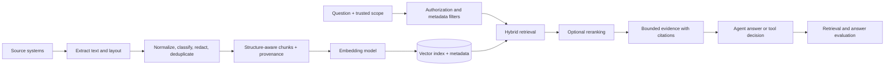

# Module 11 — Unstructured Data, RAG, and Agent Optimization

## Learning objective

Build the data path that gives an agent reliable evidence: ingest unstructured sources, clean and preserve their structure, split them into useful retrieval units, embed and store them with provenance, retrieve with authorization filters, and evaluate whether the evidence helps. Then reduce context, latency, and cost without weakening quality or safety.

Use this module with [Module 10](agentic-ai-module-10-context-retrieval-and-memory.md). Module 10's small policy catalog is the deliberately simple baseline; this module adds a data pipeline for larger and less structured corpora.

## The knowledge pipeline



Keep source records as the authority. A vector index is a derived, rebuildable search structure. Search results are evidence candidates, not permission grants and not instructions. Check access from trusted application identity before content reaches the model.

## 1. Preprocess unstructured sources

Treat extraction as its own quality stage. A document pipeline should retain the original object and create a normalized, traceable representation rather than overwriting the source.

| Source | Extraction concerns | Useful metadata |
|---|---|---|
| HTML and web pages | Boilerplate, navigation, tables, canonical URL, crawl time | URL, page title, fetched time, content hash |
| PDF | Reading order, page breaks, headers/footers, tables, scanned pages, OCR confidence | File ID, page number, parser version, OCR status |
| Word and slides | Headings, lists, speaker notes, tables, slide/page boundaries | File ID, section/slide, author if approved |
| Email and tickets | Quoted replies, signatures, attachments, participant privacy | Conversation ID, message time, tenant, access group |
| Audio/video | ASR errors, speaker turns, timestamps, language | Asset ID, time range, transcript model/version |
| Code and logs | Syntax boundaries, stack traces, secrets, timestamps | Repository/service, path, commit, environment |

Apply a repeatable sequence:

1. **Extract** with a parser suited to the source. Preserve page, heading, table, and timestamp boundaries; record parser/OCR version and extraction errors.
2. **Normalize** Unicode and line endings, remove control characters and known boilerplate, and make whitespace consistent. Preserve meaningful list/table structure and the original alongside normalized text.
3. **Classify and scope** by tenant, access group, sensitivity, jurisdiction, retention, and source status. Derive these from trusted metadata, not from text or a model-generated label alone.
4. **Redact or exclude** fields that should never be embedded or passed to a model. Basic regex redaction catches only obvious patterns; it is not a complete PII or secret scanner. Keep redaction policy and parser versions in the ingestion record.
5. **Deduplicate** exact duplicates by normalized content hash. Detect near-duplicates where repeated content would crowd the top results; preserve source links for citations and choose a canonical representation.
6. **Attach provenance**: stable source ID, version, content hash, effective date, owner/tenant, classification, page/section, and ingestion time. Keep a path back to the authoritative source.
7. **Validate** extracted text length, encoding, empty pages, OCR confidence, chunk coverage, and source counts. Quarantine malformed documents instead of silently indexing partial data.

Retrieved text is untrusted input. A document may contain prompt injection, stale instructions, private fields, or misleading content. Treat it as quoted evidence, separate it from agent policy, restrict tool authority independently, and test poisoned documents.

## 2. Choose a chunking strategy

Chunk boundaries affect both what can be found and whether a retrieved result makes sense by itself. There is no universally best chunk size; tune it on representative queries with retrieval and downstream answer metrics.

| Strategy | Strength | Cost or failure mode | Good starting use |
|---|---|---|---|
| Fixed token windows with overlap | Simple, predictable, easy to bound | Cuts tables, clauses, or narrative at arbitrary points; overlap duplicates content | Baseline for plain text |
| Recursive/structure-aware | Respects headings, paragraphs, lists, pages, code blocks, and table rows | Requires good parsers; a large section still needs splitting | Policies, manuals, HTML, code |
| Semantic boundary splitting | Splits when topic changes rather than at a fixed count | Adds an analysis step, can be unstable, and may create uneven lengths | Long mixed-topic prose where boundaries matter |
| Parent-child chunks | Small child chunks retrieve precisely; larger parent section restores context | More storage and a second fetch; deduplicate parents | Dense manuals or long policies |
| Sentence/late chunking | Can preserve broader context for token representations before making smaller retrieval units | Depends on embedding model and pipeline support; more complexity | Test only where standard chunking misses contextual links |

Practical rules:

- Keep a heading path or compact document context with every chunk so a fragment such as “within 30 days” remains interpretable.
- Split on natural structure first, then split oversized sections to meet a measured model-token budget. The sandbox uses whitespace-word counts only to stay dependency-free; production limits should use the embedding/model tokenizer.
- Use overlap to protect boundary-spanning facts, then measure duplicate results and redundant prompt tokens. More overlap is not automatically better.
- Keep tables as coherent rows with repeated column headers; preserve code blocks and speaker turns; do not flatten layout-heavy sources blindly.
- Make chunk IDs stable from source/version/section/content so re-ingestion is idempotent and updates can be traced. Keep embedding model/version separately.
- Store the source location and version for every chunk. Cite the actual source, not an opaque vector ID.

## 3. Embed, store, and refresh

The embedding model and vector store are separate parts of the system. Keep an `Embedder` interface so you can compare providers or models without changing ingestion, authorization, or agent code. Anthropic's documentation currently says Anthropic does not offer its own embedding model and demonstrates a separate embeddings provider; evaluate model quality, language/domain coverage, latency, privacy, and cost for the actual corpus. See [Anthropic's embeddings guide](https://platform.claude.com/docs/en/build-with-claude/embeddings).

Store each vector with filterable metadata, not as a detached float array. Common fields are `tenant_id`, access groups, classification, source ID, version, effective date, status, content hash, section/page, embedding model ID, and vector. Apply tenant/access/version filters inside the retrieval boundary before evidence is returned. Do not ask the model to enforce access control after retrieval.

The local lab uses SQLite to persist vectors and metadata and computes exact cosine similarity over the rows allowed by trusted tenant and classification filters. It also implements a small BM25-style lexical ranker and reciprocal-rank fusion (RRF) so you can compare dense, lexical, and hybrid paths. This makes the mechanics inspectable and runnable without an API key. Its deterministic feature-hashing embedder is **not** a semantic embedding model, and exact scanning is not a production-scale approximate-nearest-neighbor index. Replace it with a real embedding model and an appropriate vector-capable database when scale and relevance evaluations justify it. A database might combine vector search with full-text search, metadata indexes, tenant policy, backups, deletion workflows, and index-version management.

One concrete production-style option is PostgreSQL with [pgvector](https://github.com/pgvector/pgvector). The sketch below shows the important shape; use the selected embedding model's actual dimension and your database driver's vector adaptation:

```sql
CREATE EXTENSION IF NOT EXISTS vector;

CREATE TABLE document_chunks (
    chunk_id text PRIMARY KEY,
    tenant_id text NOT NULL,
    classification text NOT NULL,
    status text NOT NULL,
    source_id text NOT NULL,
    source_version text NOT NULL,
    content text NOT NULL,
    embedding vector(1536) NOT NULL
);

CREATE INDEX document_chunks_scope ON document_chunks (tenant_id, status, classification);
CREATE INDEX document_chunks_embedding ON document_chunks
    USING hnsw (embedding vector_cosine_ops);

SELECT chunk_id, source_id, source_version, content,
       embedding <=> $2::vector AS cosine_distance
FROM document_chunks
WHERE tenant_id = $1
  AND status = 'active'
  AND classification = ANY($3)
ORDER BY embedding <=> $2::vector
LIMIT 10;
```

`$1` and `$3` come from trusted authorization state, never agent-generated arguments. Add database row-level security or stronger tenant isolation if required by the threat model. pgvector performs exact search by default; HNSW and IVFFlat trade some recall for speed. With approximate indexes, selective SQL filters can leave too few candidates because filtering may happen after the index scan; benchmark filtered recall and latency, and tune iterative scans or choose a scoped/exact plan where needed. See the [pgvector indexing and filtering guidance](https://github.com/pgvector/pgvector#filtering).

Refresh lifecycle:

- Re-ingest changed source versions idempotently; mark or remove superseded chunks according to retention policy.
- When the embedding model or chunking logic changes, version it and re-embed/reindex the corpus consistently. Do not compare vectors from incompatible spaces.
- Propagate source deletion and access revocation into derived indexes and caches. Record completion and retry failures.
- Keep a small canary corpus and query set; compare new parser/chunker/embedder versions before a full rebuild.
- Batch offline embedding calls where the provider supports them. Use content hashes to skip unchanged inputs and avoid duplicate embedding work.

## 4. Query and assemble evidence

Start with the cheapest effective query path and add complexity only when errors show a need:

1. Apply hard tenant, classification, status, version/effective-date, and ACL filters from trusted runtime state.
2. Retrieve candidates using lexical search (for exact terms and identifiers), dense vector similarity (for paraphrases), or both.
3. For hybrid retrieval, merge ranks with a measured method such as reciprocal-rank fusion; normalize scores only when there is a meaningful calibration set.
4. Optionally rerank a bounded candidate set with a stronger model or cross-encoder. Measure its quality lift against added latency/cost.
5. Deduplicate overlapping chunks, cap results and total evidence tokens, and preserve source/page/section/version citations.
6. If evidence is weak or conflicting, retrieve more, ask a question, or abstain. Do not make the model fill evidence gaps from plausible-sounding guesses.

Useful modern retrieval experiments include query rewriting for ambiguous user language, contextualizing chunks with concise parent headings before embedding, BM25+dense hybrid retrieval, parent-child retrieval, and reranking. The demo implements RRF over its two ranked lists; the resulting RRF score is a rank-fusion score, not a cosine similarity and not comparable to BM25 or cosine values. Anthropic reported gains from contextual embeddings plus contextual BM25 and reranking in its [Contextual Retrieval article](https://www.anthropic.com/engineering/contextual-retrieval); treat those reported gains as a hypothesis to reproduce on your own corpus, not a promised result. For small corpora, direct lookup or just-in-time reads may remain better than embeddings; see [Effective context engineering for AI agents](https://www.anthropic.com/engineering/effective-context-engineering-for-ai-agents).

## 5. Evaluate the retrieval system separately

Use human-checked query → relevant source/chunk labels. Keep training/tuning queries separate from a holdout set and include paraphrases, exact identifiers, multilingual inputs if needed, no-answer cases, stale versions, conflicting documents, cross-tenant attempts, and injection-bearing content.

| Question | Example metric or review |
|---|---|
| Did the relevant source appear? | Recall@k, Hit@k, answerable-query coverage |
| Was it near the top? | MRR, nDCG@k, rank of first relevant result |
| Did irrelevant chunks crowd the prompt? | Precision@k, duplicate rate, evidence token count |
| Did permissions and freshness hold? | Unauthorized-result count (must be zero), stale-source rate |
| Did the answer use the evidence correctly? | Claim-to-source support, faithfulness review, citation precision |
| Was the whole system worth the cost? | End-to-end success, p50/p95 latency, embedding/rerank/model cost per successful task |

Inspect the retrieved chunks and complete agent trace, not only the final response. Break metrics down by document type and query class so a strong average does not hide failed tables, OCR, or tenant filters.

## Hands-on: local ingestion and vector query

The [sandbox lab](agentic-ai-sandbox/README.md) includes `knowledge/` Markdown sources, a manifest, a preprocessing/chunking pipeline, a SQLite vector store, and an offline feature-hashing embedder.

```sh
cd agentic-ai-sandbox
python3 run_rag_demo.py
python3 run_rag_demo.py --query "Are delivery dates promised?" --top-k 2
python3 run_rag_demo.py --tenant another-tenant
python3 run_rag_checks.py
python3 run_rag_evals.py --retriever dense
python3 run_rag_evals.py --retriever lexical
python3 run_rag_evals.py --retriever hybrid
python3 run_rag_evals.py --retriever lexical --output rag-eval.json
python3 run_rag_evals.py --dataset evals/rag_scenarios.json --retriever hybrid
```

The first demo run creates `rag-demo.sqlite` in the current directory. The demo derives a stable chunk ID, preserves heading path and policy version, embeds the chunk, stores vector plus metadata, and runs tenant-scoped cosine search. The sample classifier is synthetic. The `another-tenant` query returns no evidence because its trusted scope does not match. `run_rag_checks.py` exercises the local storage and access contract. `run_rag_evals.py` defaults to the holdout set and supports `dense`, `lexical`, or `hybrid`; the development set is selectable by path. Its optional JSON output includes corpus/dataset fingerprints and retrieved chunk IDs with source metadata for trace review. A `GAP` and nonzero exit code show retrieval misses or false positives, not a code crash.

On `rag-retrieval-holdout-v2` (ten synthetic queries, two short policy documents, and a feature-hashing placeholder), dense scored 60% overall scenario pass, 50% positive-source coverage, and 75% no-answer accuracy; BM25-style lexical scored 100% on scenario pass and positive-source coverage, 100% no-answer accuracy, and 89% unique-source precision; hybrid RRF scored 90% scenario pass, 100% positive-source coverage, 75% no-answer accuracy, and 89% unique-source precision. This demonstrates threshold and retrieval trade-offs on this tiny authored set only. It does not establish performance on real data or evaluate a semantic embedding model. In particular, the placeholder dense path returned a false positive for an unrelated capital-city query, and RRF carried that false positive through.

### Expanded corpus evaluation

To make retrieval review more representative, the sandbox now also includes 15 manifest entries over multiple support topics, one superseded policy version, three classifications, and two tenants. The advanced development and holdout sets each have 20 queries. They cover paraphrase, multi-source retrieval, current-version requirements, hard negatives, no-answer behavior, and access-scope checks. `run_rag_evals.py --manifest knowledge/advanced/manifest.json` selects this corpus. The evaluator grades expected source versions and records forbidden-source leakage separately from relevance false positives.

On `agentic-rag-advanced-holdout-v1`, the measured dense / lexical / hybrid results were:

| Metric | Dense feature hash | BM25-style lexical | Hybrid RRF |
|---|---:|---:|---:|
| Scenario pass | 50% | 95% | 90% |
| Required positive-source coverage | 50% | 100% | 100% |
| Hit@1 | 25% | 81% | 69% |
| Recall@5 sources | 50% | 100% | 100% |
| MRR | .339 | .877 | .804 |
| No-answer accuracy | 0% | 50% | 0% |
| Unique-source precision | 31% | 34% | 31% |
| Forbidden-source leaks | 0/2 | 0/2 | 0/2 |

The lexical baseline ranked every required source in this authored holdout but returned irrelevant sources and failed one hard-negative query. Dense and hybrid retrieval failed to abstain on the two no-answer cases; hybrid inherited lexical and dense candidates. The authorization cases showed no forbidden-source leakage under the tested filters, but two cases are far too few to establish tenant isolation. These results make the next step clear: improve negative-query threshold calibration, then compare with a real embedding model on a larger independent corpus. The feature-hashing dense result remains a plumbing diagnostic, not semantic retrieval evidence.

`advanced_holdout_v1` has now been inspected and should be treated as a regression set, not an untouched benchmark for future tuning. Preserve a new holdout version for the next retrieval-model or threshold decision.

Explore the code in [rag_pipeline.py](agentic-ai-sandbox/rag_pipeline.py). Then extend the exercise:

1. Add a long document and compare 40/8, 90/18, and structure-aware chunking (maximum words / overlap words in this lab). Inspect boundaries and duplicate retrieval.
2. Add one superseded version and confirm that only the active version is returned.
3. Add one internal-only and one confidential source; vary the trusted allowlist and verify each result set.
4. Replace `HashingEmbedder` with a real embedding adapter and re-run a labeled query set. Keep the same metadata and filters.
5. Compare the included BM25-style lexical and RRF hybrid paths against the dense placeholder. Explain the holdout's false positive and missed paraphrases. Add a real semantic embedder or reranker only when a new labeled evaluation can show the quality lift against added latency and cost.
6. Add an adversarial instruction inside a document and verify it is treated as quoted data, never as system policy.

## Current optimization techniques for agentic systems

Optimize measured end-to-end quality and cost per successful task, not tokens in isolation. Preserve application-side authorization, budgets, and approvals as fixed invariants.

### Prompt caching (Anthropic + Python)

Prompt caching is a prefix reuse mechanism. Stable tools and system instructions should precede request-specific context. A change in a cached prefix can invalidate later cache points, so keep serialization/order deterministic and avoid putting timestamps or request IDs into stable prompt blocks. Anthropic supports automatic caching at request level and explicit `cache_control` breakpoints; its current default ephemeral lifetime is five minutes, and a one-hour TTL is available with different pricing. Check the current [Prompt Caching guide](https://platform.claude.com/docs/en/build-with-claude/prompt-caching) for model minimums, supported platforms, pricing, and exact SDK behavior.

```python
response = client.messages.create(
    model=model,
    max_tokens=800,
    # Stable tools + stable system prefix are cacheable. Keep user-specific data below.
    system=[{
        "type": "text",
        "text": STABLE_SYSTEM_POLICY,
        "cache_control": {"type": "ephemeral"},
    }],
    tools=STABLE_TOOL_SCHEMAS,
    messages=[{"role": "user", "content": request_and_fresh_evidence}],
)

usage = response.usage
cache_reads = getattr(usage, "cache_read_input_tokens", 0)
cache_writes = getattr(usage, "cache_creation_input_tokens", 0)
```

The system marker above caches the prefix through the system block, including preceding tools. A short prompt may not satisfy the provider's model-specific minimum cacheable length; Anthropic processes shorter marked prompts without caching, so check `cache_creation_input_tokens` and `cache_read_input_tokens`. A cache write can cost more than an uncached read. Confirm reuse from usage metrics and compare repeated-request latency and total cost. Use a longer TTL only when the reuse pattern and current pricing justify it. Keep tenant-specific/private evidence out of shared or broadly reused cache keys unless the provider and your data-handling design explicitly support that scope.

The sandbox's `AnthropicPlanner` supports opt-in stable-prefix caching through `enable_prompt_caching=True`; `run_live_evals.py` exposes `--prompt-caching` and `--prompt-cache-ttl`. Fake-client checks verify the request shape and metric capture without making a request. The current support prompt/tool set is intentionally small and may be below the active model's cache minimum. A live comparison requires repeated requests and may incur charges; the runner keeps caching off by default.

### Other high-value optimizations

- **Just-in-time context:** pass identifiers and retrieve the needed record only when required. Avoid stuffing the full corpus and full run history into every turn.
- **Tool discovery / deferred loading:** if the tool catalog is large, expose common tools directly and retrieve specialized schemas on demand. Anthropic documents a server-side [tool search tool](https://platform.claude.com/docs/en/agents-and-tools/tool-use/tool-search-tool); it is model/provider-specific, so compare context savings and tool-selection quality before adopting it.
- **Bounded context compaction:** keep durable state outside the model. Compact or summarize older turns when needed, preserve recent critical turns and references, then reload authoritative records before consequential actions. Anthropic's current [compaction documentation](https://platform.claude.com/docs/en/build-with-claude/compaction) describes provider-managed options; verify model/platform compatibility and treat summaries as non-authoritative.
- **Choose compaction or context editing deliberately:** compaction replaces older history with a summary; context editing selectively clears content such as obsolete tool results. Anthropic documents on-demand compaction as beta and targeted [context editing](https://platform.claude.com/docs/en/build-with-claude/context-editing). Check compatibility, keep the original durable journal outside the prompt, and never treat a summary as authoritative state.
- **Cache embeddings and retrieval carefully:** cache document embeddings by normalized-content hash plus embedding model/version. Cache query results only with query normalization, tenant/ACL scope, corpus/index version, and freshness in the key; invalidate on permission or source changes.
- **Batch independent work:** batch document embeddings and independent read-only tool calls. Parallelism can reduce wall time while preserving total token/API spend; do not parallelize dependent writes or bypass idempotency, approval, or rate limits.
- **Route by task difficulty:** use deterministic code for validation and known branches, a smaller/cheaper model for classification or extraction only if it meets the eval threshold, and a stronger model for genuinely difficult reasoning. Measure routing mistakes and fallback cost.
- **Trim tool outputs:** return only fields needed for the next decision, cap rows and characters, and keep large payloads in storage with handles for follow-up reads.
- **Use structured outputs and schemas:** validate tool arguments and final machine-readable results at application boundaries; schema conformance does not establish authorization or factual accuracy.
- **Stop loops early:** bound model turns, tool calls, output tokens, retries, deadline, and total spend. Use deterministic calculations and direct APIs for work that does not need model judgment.
- **Compare safe cache keys:** prompt and semantic caches can cross users or tenants if keyed poorly. Bind access scope, policy/index version, model version, and relevant personalization into keys; never rely on a cache hit as an authorization check.

### Senior optimization discipline

Treat optimization as controlled experimentation. Start with quality/cost/latency by task class, then change one variable at a time on the same versioned cases. Include tail metrics and safety guardrails, not only average tokens. Use cache diagnostics when expected prefix reuse is absent; deterministic serialization/order and recent repeated prefixes matter. Prompt caching reuses a prefix; it does not remove tokens from the logical prompt or make mutable data safe to share.

Anthropic's current tool-search API can defer loading a large tool catalog until relevant schemas are discovered. This is useful for a large catalog, not automatically for a small one: discovery adds a decision and may select the wrong capability. Keep frequent tools directly available, monitor discovered tools and failures, and compare selection accuracy and total context. The provider's tool-use/prompt-cache guide documents cache breakpoints on tool definitions and how deferred loading interacts with them; verify current model/API compatibility before adoption. See [Tool search](https://platform.claude.com/docs/en/agents-and-tools/tool-use/tool-search-tool) and [Tool use with prompt caching](https://platform.claude.com/docs/en/agents-and-tools/tool-use/tool-use-with-prompt-caching).

For cache or compaction experiments, include isolation tests: tenant crossing, policy/index version change, source deletion, stale authorization, changed tool schema, and provider cache miss. Revalidate authorization at retrieval time. Measure quality, retrieval support, cache reads/writes, tokens, provider/tool calls, p50/p95/p99, errors, and estimated cost per successful task. Roll back if savings shift risk into stale evidence, missed tools, unsupported answers, or tail latency.

For retrieval, compare chunk size/overlap, parser version, lexical/dense/hybrid candidates, reranker depth, context budget, and citations as separate factors. Tune on development data, report the untouched holdout once, and preserve a fresh challenge set before release. A good retrieval score does not guarantee grounded answers, and a lower token count does not mean better retrieval.


### Optimization scorecard

For each change, compare the same versioned cases and trace graders before and after. Track task success, policy/security failures, retrieval Recall@k and citation support, model calls, prompt/cache-read/cache-write tokens, tool calls, embedding/reranking calls, p50/p95 latency, and estimated cost per successful task. Reject an optimization that saves average tokens but increases critical errors, stale evidence, unauthorized disclosure, or tail latency beyond the task's target.

## Mastery checkpoint

Draw the source-to-answer pipeline for one real unstructured dataset. For every field, identify its source of truth, tenant/ACL scope, sensitivity, retention, version, and deletion path. Pick one chunk strategy and one retrieval baseline, define a labeled holdout set, and set release thresholds. Then choose two optimizations—one data/retrieval optimization and one agent/runtime optimization—and state what evidence would make you keep or revert each.

## References

- [Anthropic embeddings guide](https://platform.claude.com/docs/en/build-with-claude/embeddings)
- [Anthropic Prompt Caching](https://platform.claude.com/docs/en/build-with-claude/prompt-caching)
- [Anthropic Contextual Retrieval](https://www.anthropic.com/engineering/contextual-retrieval)
- [Anthropic Effective Context Engineering for AI Agents](https://www.anthropic.com/engineering/effective-context-engineering-for-ai-agents)
- [Anthropic Tool Search Tool](https://platform.claude.com/docs/en/agents-and-tools/tool-use/tool-search-tool)
- [Anthropic Compaction](https://platform.claude.com/docs/en/build-with-claude/compaction)
