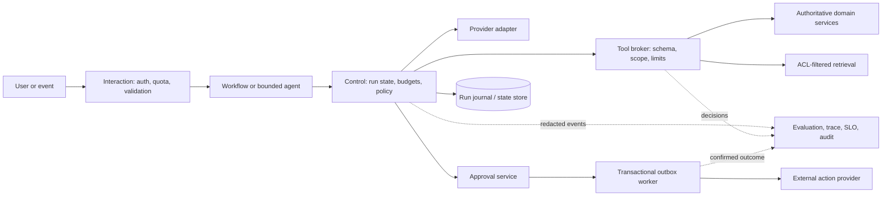

# Module 12 — Senior AI Engineer and Architect Practicum

## Purpose and outcome

This final practicum turns the eleven preceding modules into one reviewable system design. Produce an architecture dossier another senior engineer could implement and an architect could review for product fit, interfaces, data, risk, cost, reliability, and operations.

This is a design exercise, not a production-readiness certificate. The support-agent sandbox uses synthetic data and now demonstrates local SQLite worker leases, fencing, compare-and-swap, a two-thread claim race, and heartbeat behavior during slow/failing simulated tool calls. Those checks do not establish multi-host database behavior, provider/network failure behavior, real identity/provider integrations, production load, or operational readiness. Stronger evidence requires representative workloads, approved data, operational owners, and deliberate failure drills.

At the end, defend these decisions:

1. Why does this problem need model judgment, and which steps stay deterministic?
2. What are the trust boundaries, authority boundaries, and sources of truth?
3. What are the quality, safety, latency, availability, privacy, and cost objectives?
4. What happens during retries, concurrency, stale data, provider outage, partial action, and recovery?
5. What evidence is sufficient for each launch stage, and who owns residual risks?

The central review criterion is traceability: every important product requirement maps to an architectural control, an evaluation or operational signal, and an accountable owner.

## Quantitative and interview companions

Use the [worked capacity/cost exercise](agentic-ai-worked-capacity-and-cost.md) to turn assumptions into storage, throughput, quotas, concurrency, latency budgets and reviewer staffing. Use [Mock A and the scoring rubric](agentic-ai-interview-workbook.md) to defend the dossier under changed assumptions. The [advanced labs](agentic-ai-advanced-labs.md) define evidence-building experiments for the open implementation and operations gates.

Extend the dossier with a [platform decision case](agentic-ai-architecture-decision-cases.md), an actual [completed reference experiment](agentic-ai-completed-reference-solutions.md) you reproduce, and a [leadership narrative](agentic-ai-leadership-interview-practice.md) from your own work. Use the [numerical workbook](agentic-ai-numerical-workbook.md) to defend mechanism and sizing assumptions.

## 1. Write the decision brief

Before drawing components, document:

| Field | Required decision |
|---|---|
| User and job | Who asks for what outcome, in which channel, and how often? |
| Task distribution | Common, rare, ambiguous, adversarial, and high-impact classes; include proportions and uncertainty. |
| Baseline | Human process, deterministic workflow, search, or direct model call; measure quality, latency, and cost where possible. |
| Autonomy boundary | What may the model propose, what does code decide, and what requires an authenticated human? |
| Sources of truth | Authoritative systems for identity, entitlements, current facts, policy, approval, and action completion. |
| Failure impact | User, financial, legal, privacy, safety, and operational impact of false answers, missed tasks, excess access, and duplicate actions. |
| Constraints | Data residency, retention, provider limits, availability, latency, accessibility, audit, and budget requirements. |
| Non-goals | Explicitly list work this release will not automate. |

### Decide whether an agent is justified

Estimate how often the next action depends on evidence discovered during the run. Keep a deterministic route for common structured work and send only genuinely variable tasks to a bounded planner. Compare architectures on the same cases. Do not justify an agent by novelty or by tool count.

For each candidate route, compare expected quality lift and human time saved with inference, orchestration, review, data, and on-call cost. Include the extra risk from nondeterminism, broad access, provider dependency, and retained traces. State a measurable kill criterion: what result disables the agent route?

## 2. Turn requirements into testable service objectives

Separate functional behavior from non-functional requirements. For each objective, record the metric definition, population, measurement window, target, error budget, owner, and evidence source. Product and risk owners set target values; placeholders are not commitments.

| Dimension | Measure example | Design consequence |
|---|---|---|
| Task quality | Resolution without correction by task class | Representative end-to-end evaluations and feedback labels |
| Grounding | Supported claims / claims requiring evidence | Source provenance and answer checks |
| Safety | Unauthorized disclosure or write count | Hard release blocker; server-side enforcement and adversarial tests |
| Latency | p50/p95/p99 from accepted request to useful result | Deadlines, queue sizing, asynchronous status, progress updates |
| Availability | Safe useful completion and handoff rate | Deterministic fallback, circuit breaker, graceful handoff |
| Cost | Cost per successful task and spend per tenant | Per-run budget, routing, caching, quota and attribution |
| Privacy | Retention/deletion compliance and trace exposure | Data minimization, field-level retention, deletion propagation |
| Human review | Queue age, disagreement, override and reversal rates | Reviewer capacity, exact proposal display, expiry handling |

Use SLIs that reflect user outcomes, not only API uptime. A healthy model endpoint does not mean retrieval, authorization, queueing, or grounding is working. Define separate objectives for read-only help and consequential actions when their risk differs.

## 3. Design explicit system planes

Use four logical planes, even if the first deployment combines some services:

1. **Interaction:** channel/API, authentication, request validation, consent, status, streaming, and cancellation.
2. **Control:** run lifecycle, policy, budgets, model adapter, planner loop, tool registry, approval state machine, and workflow routing.
3. **Data/action:** source-of-truth services, ingestion/retrieval, domain tools, approval/outbox, and external providers.
4. **Evidence/operations:** event journal, traces, redaction, evaluations, metrics, alerts, audit, release controls, and incidents.



The model proposes a step. The control plane owns whether it is allowed. Domain services remain authoritative for current facts and permissions. A model's final text is not proof that a business action completed.

For every component, state the data it owns, APIs it exposes, consistency guarantee, and failure mode. Avoid duplicating business truth in prompts, vector indexes, caches, and databases. A vector index is rebuildable derived data; an approval row is an authorization record; a model summary is lossy convenience state.

## 4. Specify versioned contracts

Define contracts before framework classes. Keep provider-specific types in the adapter and convert them to an internal decision type. Reject unknown fields at security-sensitive boundaries.

| Contract | Minimum fields and invariant |
|---|---|
| `Run` | Run/tenant IDs, authenticated subject reference, request digest, status, timestamps, deadline, budget counters, model/prompt/tool/policy versions. Identity comes from authentication. |
| `Decision` | Kind, proposed tool and arguments or final answer, provider event ID, stop reason. A model decision is untrusted. |
| `ToolCall` | Tool/schema version, run/tenant scope, write idempotency key, deadline, correlation ID, validated input digest. Never accept model-supplied authority. |
| `Observation` | Bounded typed data, source ID/version/freshness, classification, safe error code, and side-effect status. |
| `Evidence` | Claim/source mapping, citation locator, document/index version, retrieval method, authorization scope, freshness. |
| `Approval` | Authenticated reviewer/role, exact proposal digest, displayed payload version, decision, expiry, audit event. |
| `TraceEvent` | Run/parent IDs, event type, component/version, time/duration, redaction status, outcome. Exclude unnecessary content and secrets. |

Use idempotent write semantics, request/response size limits, explicit timeout behavior, stable error categories, and schema compatibility rules. Document optional, additive, deprecated, and breaking fields. During deployment, old workers may still process queued events, so schema migration is a distributed rollout problem.

## 5. Engineer for partial failure and concurrency

Assume queues and networks deliver at least once. “Exactly once” across a database and external provider is not the default. Model each consequential operation as a state machine with an explicit unknown outcome.

- Record intent and a stable idempotency key before a consequential call.
- Bind the key to a canonical payload digest, tenant, and operation. Reject reuse with different content.
- Use unique constraints for local deduplication; a read followed by a write is not concurrency control.
- Use leases and fencing tokens for multiple workers. An expired worker cannot commit after another worker owns the run.
- Commit approval and its outbox event in one transaction; retry delivery with the same provider key.
- Treat timeout-after-submit as `outcome_unknown`; reconcile before retrying with a new key or telling the user it failed.
- Make cancellation cooperative at safe boundaries. If a write is in flight, cancellation starts reconciliation; it does not imply reversal.
- Use compensating actions only when their semantics and risks are understood. A refund reversal is not a generic rollback.
- Version event payloads and test replay across supported versions.

Design for two turns arriving together, two reviewers deciding together, and a retry racing with a delayed original response. Use optimistic concurrency or compare-and-swap for state transitions. Define when a conflict retries, refreshes, rejects stale input, or hands off.

For each dependency, record timeout, retryability, retry budget, circuit breaker, fallback, and operator signal. Use bounded backoff with jitter for transient failures; do not retry invalid input, denied access, expired approval, or a write with unknown outcome. Avoid retry multiplication across SDK, application, worker, and queue layers. Specify backup retention, point-in-time recovery, restore objectives, key rotation, index rebuild, and owner. Choose zonal or regional failover from the service objectives and consistency needs; document replication lag, failover authority, and recovery behavior. A backup policy without a restore exercise is not recovery evidence.

## 6. Treat unstructured knowledge as a data product

The dossier should identify source owner, parser/version, content hash, permitted use, tenant/access labels, sensitivity, retention, and deletion source. Add modality-specific quality checks: OCR confidence/page coverage for PDFs; table integrity for spreadsheets; speaker/timestamp quality for audio; syntax boundaries for code.

Specify normalization, duplicate handling, secret/PII exclusion, quarantine, source-to-chunk lineage, tokenization, chunking, embedding model/version/dimension, metadata schema, index version, rebuild/rollback, freshness target, and deletion propagation. Define stale/withdrawn-source behavior and the authoritative correction path.

For major re-indexes, build a versioned index, run relevance and authorization tests, compare to the current index, promote an alias, monitor, and retain rollback. A partially populated index must not silently replace the known-good one. When access is revoked, deny immediately even if physical deletion of derived data is asynchronous.

Evaluate candidate recall separately from answer grounding: Recall@k, MRR/nDCG where ranking matters, source coverage, citation correctness, stale-source rate, no-answer precision/recall, and unauthorized retrieval (must be zero). Benchmark with tenant/classification filters enabled; unfiltered ANN quality is irrelevant if filters change candidate recall.

## 7. Build a credible evaluation and release system

Create three related suites:

1. **Contract/invariant:** schemas, permissions, budgets, state lifecycle, idempotency, deletion, and side-effect checks.
2. **Behavior:** representative tasks and complete trajectories: normal, ambiguous, incomplete, adversarial, and recovery.
3. **Operational:** load, rate limits, timeout, dependency failure, restart, cancellation, queue growth, provider outage, and restore drills.

Every case names its source, risk, intended behavior, grader, and failure severity. Keep a held-out set for design/model/prompt comparisons. Grade outcomes and trajectories: tool selection, arguments, policy, evidence, stop behavior, and resource use. Calibrate model-based graders against blinded human judgments. Use code and source state for access control and transactions whenever inspectable.

For stochastic behavior, report trial counts and intervals, not a best run. Stratify by task type, ambiguity, language, tenant scope, and impact. With zero observed failures in `n` independent trials, the approximate 95% upper bound is still `3/n` (rule of three); a few green trials cannot support a tiny catastrophic-failure claim. Size the evaluation to the risk threshold that matters and add targeted adversarial tests for invariants that statistics cannot guarantee. Repeatedly tuning against a “holdout” turns it into training data.

Release gates should be explicit:

- **Hard safety:** zero unauthorized reads/writes, secret exposure, duplicate consequential effects, and unreconciled tested outcomes.
- **Quality:** task success and grounding by class meet product-defined thresholds against a baseline; abstention and handoff are measured.
- **Operations:** tail latency, spend per success, queue age, provider error rate, and quotas meet approved objectives under representative load.
- **Human process:** trace sample reviewed, grader calibration accepted, operators trained, runbooks and kill switches exercised.

Do not average away a severe regression with easy cases. Record dataset, grader, model/provider, prompt/tool/policy hashes, configuration, and environment.

## 8. Budget and optimize with a cost model

Estimate from measured distributions rather than one average:

```text
expected task cost = Σ route probability ×
  (model input/output + cache read/write + tool/API + embedding + rerank + infrastructure)
monthly spend = task volume × expected task cost + fixed platform/storage/observability costs
average in-flight work ≈ arrival rate × average time in system (Little's Law)
```

Include tails: a small number of long loops can dominate spend, queue capacity, and p99 latency. Track cost by tenant and task class; include retry, cache-miss, burst, and price-change scenarios. Enforce per-run and per-tenant caps in code.

Optimize in this order: remove unnecessary model decisions; trim irrelevant context/tool output; improve retrieval; reuse stable prefixes with provider caching where supported; defer rarely used tool schemas when the catalog is large; parallelize only independent work; batch offline embeddings/evals; route task classes only after quality evaluation; compact history only when authoritative state can be reloaded. For each change, compare the same cases and traces for quality, safety, cost, p50/p95/p99, cache behavior, provider errors, and fallback frequency. Roll back if savings depend on losing required evidence, increasing critical errors, or exceeding tail objectives.

## 9. Design privacy, security, and governance

Inventory user input, retrieved text, tool outputs, prompts, provider logs, traces, evaluations, caches, embeddings, and backups. For each, identify owner, purpose, sensitivity, region, retention, access, deletion behavior, and incident owner.

Threat-model direct and indirect prompt injection; confused-deputy calls; cross-tenant retrieval; broad credentials; authorization races; exfiltration through answers/tools/traces/caches/errors; supply-chain threats in MCP servers, parsers, OCR, embedding services, model versions, and evaluation artifacts; denial of service through large input, recursive delegation, oversized results, or retry storms; and approval fatigue or stale approvals.

For each high-risk case, state prevention, detection, containment, recovery, owner, and test. Use identity-scoped short-lived credentials, outbound allowlists, tool authorization, input/output validation, rate limits, and tenant isolation. Cache entries and compaction summaries are derived sensitive data; a cache hit never proves current access. Recheck access at read time and scope cache keys to tenant/policy/index/model versions where relevant.

Maintain model inventory and change control: approved models, provider data settings, prompt/tool ownership, version-drift monitoring, fallback, and evaluations required before upgrade. Separate reversible config changes from data/schema migrations and action-policy changes.

## 10. Plan rollout, monitoring, and ownership

Use staged launch criteria:

1. **Offline:** contract, security, behavior, recovery, and load suites on versioned artifacts.
2. **Shadow:** compare planning with outcomes on governed traffic; do not execute proposed writes.
3. **Read-only canary:** limited users/task classes, low concurrency, and a fast disable path.
4. **Proposal mode:** structured proposals with authenticated human review and known reviewer capacity.
5. **Constrained action pilot:** only after provider idempotency, reconciliation, audit, identity, incident, and recovery drills pass.

Assign an accountable owner and backup for model/provider integration, orchestration, each domain tool, retrieval/ingestion, privacy/traces, review, and external action delivery. Every alert needs a runbook and safe degradation action. Use separate kill switches for model planning, retrieval, individual tools, proposal creation, and outbox delivery.

Monitor task success/handoff, tool calls/denials, retrieval coverage, provider/cache metrics, queue age, state counts, unknown-outcome backlog, cost by route, p95/p99, and sampled trace review. Define response for cross-tenant exposure, unauthorized action, poisoned source, trace leak, provider outage, and cost spike. After incidents, add a sanitized regression case and revise controls, not only the prompt.

## 11. Architecture dossier template

Use these headings for the capstone:

1. Executive decision: selected architecture, why agentic behavior is needed, alternatives rejected, residual risk.
2. Requirements: task taxonomy, workload, NFRs/SLOs, budget, non-goals, owners.
3. Architecture: component/deployment diagrams and success, denial, timeout, restart, approval, unknown-outcome sequences.
4. Contracts: run state, tool schemas/ACLs, evidence, approval binding, idempotency key, event/API versions.
5. Data/retrieval: preprocessing, chunk/index version, filters, citations, retention/deletion, freshness, rebuild/rollback.
6. Threat model: assets, boundaries, abuse cases, controls, detection, response, open risks.
7. Evaluation: baseline, datasets/holdout, graders, calibration, trial method, gates, results, limitations.
8. Reliability/operations: limits, retries, cancellation, fallback, SLOs, capacity, DR, runbooks, owners.
9. Economics: cost distribution, cost per success, optimization experiments and rollback criteria.
10. Decision log: ADRs with context, options, decision, consequences, reconsideration trigger, owner, date.
11. Readiness table: requirement, evidence, status, evidence owner, next action.

### Architecture decision record template

```text
Title / status / date / owner
Context: requirement, constraints, evidence, failure impact
Decision: chosen approach and scope
Alternatives: viable options and why rejected
Consequences: quality, latency, cost, privacy, reliability, maintenance
Controls: invariants and enforcement points
Evidence: eval, trace, benchmark, or operational drill
Reconsider when: measurable trigger or changed assumption
```

## 12. Senior design review rubric

Score each area 0–3 and cite evidence:

| Score | Meaning |
|---:|---|
| 0 | Unspecified or unsafe; depends on model compliance or optimistic assumptions. |
| 1 | Described, but important contracts or failure cases are ambiguous. |
| 2 | Implementable; deterministic controls and testable evidence are defined. |
| 3 | Operationally credible; representative measurements, failure drills, owners, rollback, and accepted residual risk are documented. |

Review product/autonomy fit; interfaces and boundaries; data/retrieval; security/privacy; evaluation validity; distributed reliability; SLO/capacity/cost; human factors/governance; deployment/incident response. Design-only work may score below 3 if it labels missing evidence. For a high-impact launch, authorization, privacy, action integrity, and recovery cannot be waived by a high average score.

## Final mastery exercise

Use the sandbox or a bounded synthetic/sanitized task. Produce the dossier, then conduct red-team and failure-injection reviews with another engineer. Ask the reviewer to trace any requirement through source of truth → component contract → runtime enforcement → evaluation → monitoring → recovery owner. Revise any broken chain.

Present three design decisions you would reverse if evidence changed, the thresholds that would trigger reversal, and one deliberately rejected optimization. Recommend a launch stage: design-only, offline prototype, shadow, read-only canary, proposal pilot, constrained action pilot, or not ready. Cite the evidence for that stage and label claims as **implemented and measured**, **designed but unverified**, or **assumption**.

## References

- [Anthropic: Building effective agents](https://www.anthropic.com/engineering/building-effective-agents)
- [Anthropic: Evaluating AI agents](https://www.anthropic.com/engineering/demystifying-evals-for-ai-agents)
- [Anthropic: Prompt caching](https://platform.claude.com/docs/en/build-with-claude/prompt-caching)
- [Anthropic: Tool search](https://platform.claude.com/docs/en/agents-and-tools/tool-use/tool-search-tool)
- [Anthropic: Context editing](https://platform.claude.com/docs/en/build-with-claude/context-editing)
- [OWASP: Top 10 for Agentic Applications](https://genai.owasp.org/resource/owasp-top-10-for-agentic-applications-for-2026/)
