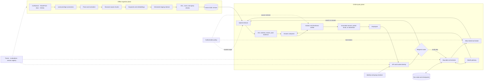
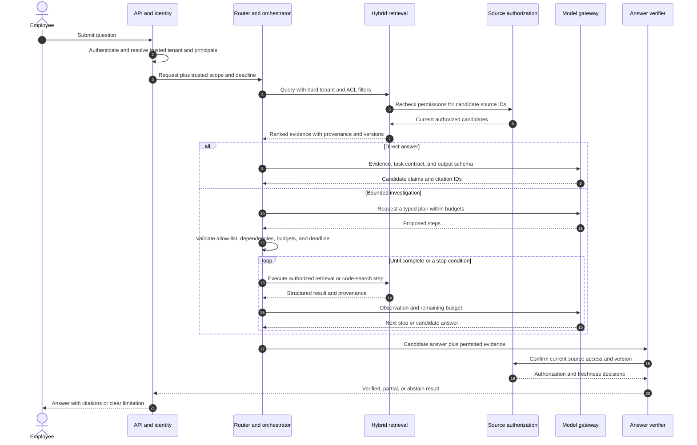

# Harper Enterprise Knowledge and Code Intelligence Agent

This worked example turns the supplied Harper system-design notes into an end-to-end architecture study. It shows how to move from an open-ended product request to high-level design, data and trust boundaries, low-level contracts, failure handling, evaluation, and a staged implementation plan.

## Evidence boundary

The supplied document labels the following capabilities as resume-backed: permission-aware search across Confluence, SharePoint, document stores, and GitHub code; hybrid retrieval, reranking, and citations; incremental indexing and advanced chunking; bounded planner-executor orchestration; and prompt-injection defenses, evaluation, audit logging, and observability.

The document does not provide a code repository, exact deployed providers or stores, workload numbers, measured SLOs, or individual ownership details. The architecture, schemas, and Python below are therefore a **proposed reference design**. Use them to explain how the system could work. Before saying a component or result was shipped, replace it with a verified fact from the actual project.

## 1. Start with the problem, not the model

### Problem statement

Employees need to find and understand internal documentation and code spread across several enterprise systems. They want answers with inspectable evidence, including investigations that combine documents and code. The system must preserve each source's access policy as content is added, changed, deleted, or re-permissioned.

Harper is an assistant over existing sources. It is not the source of truth, an unrestricted repository agent, or a system that can reveal content just because a model ranked it highly.

### Users and jobs

- Find an authoritative policy, runbook, design, code symbol, implementation, or owner.
- Get a concise answer with citations that lead back to permitted source content.
- Compare evidence across documents and code for a bounded investigation.
- Understand when evidence is missing, stale, conflicting, or outside the user's access.

### Non-goals for the first release

- Modify repositories, tickets, or enterprise documents.
- Let a model choose a tenant, user identity, access group, or security classification.
- Treat a vector index or generated answer as the canonical record.
- Persist personal preferences as long-term memory without an explicit policy.
- Claim a complete answer when a source failed or the evidence is incomplete.

### Clarify before sizing

In an interview, ask for the facts that change the architecture. If the interviewer cannot provide them, state assumptions and mark them for validation.

| Question | Why it changes the design |
| --- | --- |
| Which users, source systems, and content types are in scope? | Determines identity mapping, connector work, parser coverage, and access policies. |
| How many documents, repositories, users, changes per day, and queries per day? | Drives index choice, sync throughput, concurrency, and capacity. |
| How quickly must edits, deletions, and permission changes take effect? | Sets synchronization and authorization freshness requirements. |
| What does a useful answer look like, and what is the cost of a wrong answer? | Determines citation, abstention, verification, and human-review requirements. |
| What are the latency, availability, and per-task cost targets? | Helps choose direct retrieval versus planning and sets budgets. |
| Which regions, data classifications, audit rules, and retention rules apply? | Constrains parsers, model endpoints, caches, logs, and storage. |

## 2. Use a high-level-to-low-level design sequence

### Step 1: Define requirements and risk classes

Separate requirements into user-visible behavior, quality attributes, and hard security invariants.

- **Behavior:** search, grounded answer, or multi-source investigation.
- **Quality:** relevance, grounded claims, freshness, latency, availability, and cost.
- **Security invariants:** no cross-tenant retrieval, no content outside current ACLs, no untrusted text treated as executable instructions, and no secrets in traces.

For the first release, make the online surface read-only. Treat investigation as a bounded sequence of retrieval and analysis steps, not an open-ended permission to use arbitrary tools.

### Step 2: Choose the smallest control flow that fits

Classify requests into three paths:

1. **Direct search:** return ranked, permission-filtered source results.
2. **Grounded answer:** retrieve a small evidence set, draft an answer, and verify its citations.
3. **Bounded investigation:** plan a limited number of allow-listed retrieval or code-search steps, checkpoint progress, and stop on budget, deadline, or sufficient evidence.

Do not invoke a planner for a simple lookup. Compare these paths against one another using the same task set; keep the planner only where it improves task success enough to justify added calls, latency, and failure modes.

### Step 3: Draw trust boundaries and ownership

Identity and source permissions belong to trusted services. Retrieval filters and tool checks use identity resolved by the application, never claims supplied by the model or user text. The model may propose a query, plan, or answer; deterministic application code validates it and owns authorization, budgets, retries, checkpoints, and termination.

### Step 4: Sketch the high-level architecture



The design has three meaningful planes. Ingestion transforms source data into versioned derived indexes. The online plane retrieves evidence and, for some requests, runs a bounded plan. Cross-cutting identity, authorization, tracing, evaluation, and configuration versioning apply to both.

### Step 5: Define the data and consistency model

Keep the source system authoritative. The index is a derived view with provenance and version metadata. A document update can change text, ACLs, or both; permission-only changes must not be skipped because the content hash stayed constant. Deletions and revoked permissions need an explicit propagation path and a measured lag.

### Step 6: Specify APIs and state transitions

Define typed request, plan, tool-result, evidence, and answer contracts before wiring model calls. Bound step count, concurrency, result bytes, token use, and wall-clock time. Persist enough task state to resume an investigation without silently repeating work.

### Step 7: Walk through success and failure paths

For the normal path, trace authentication, retrieval, ranking, drafting, citation checks, and response. Then repeat with an ACL change, source timeout, stale index, malformed plan, model throttle, citation mismatch, worker crash, and exhausted budget. Specify the expected user response and the operator signal for every case.

### Step 8: Design evaluation and rollout

Measure retrieval, grounding, task success, authorization, latency, cost, and freshness separately. Use development and holdout sets. Release a versioned bundle of prompts, model route, tool schemas, retrieval settings, and active-index version through shadow or canary stages, with rollback criteria.

## 3. Detail the offline ingestion and indexing plane

### Pipeline


### Normalize heterogeneous content

Connectors should produce a canonical record regardless of whether the source was a wiki page, a SharePoint file, or a Git repository. Preserve structure rather than flattening everything into one string:

- Documents: title, heading path, paragraphs, lists, tables, links, and page or section provenance.
- Code: repository, ref or commit, path, language, symbol kind, symbol name, parent module, and line range.
- Shared metadata: tenant, source object ID, source version, classification, ACL principals, modified time, content hash, ingestion run, and tombstone state.

Treat parsers as an attack surface. Enforce file-size and decompression limits, validate actual format instead of trusting extensions, isolate complex parsers, and avoid executing macros or repository content. Record parse failures and send unsupported or corrupt items to a reviewable dead-letter path.

### Chunk with structure and provenance

Chunking is a retrieval design choice that needs evaluation:

- Split prose at headings and semantic sections; split an oversized section at paragraph or token boundaries with limited overlap.
- Keep tables coherent, or represent rows with their header and parent section so retrieved cells retain meaning.
- Chunk code by function, method, or class. Attach file and enclosing-symbol context when useful.
- Use parent/child links for long pages: retrieve focused children and add parent context selectively.
- Put source URI, version, heading path, page/line range, tenant, ACL, and chunking version on every chunk.
- Rebuild only changed content when possible, but update ACL metadata independently of text and embedding changes.

Do not pick a universal token size from intuition. Compare structure-aware chunks and an overlapping-window baseline on labeled queries, measuring recall, precision, answer support, duplicate evidence, latency, and token cost.

### Canonical record and code example

The following are proposed types. Adapt names, principal semantics, storage, and version fields to the actual connectors and identity system.

```python
from dataclasses import dataclass
from datetime import datetime
from typing import Literal


@dataclass(frozen=True)
class ContentRecord:
    tenant_id: str
    source_system: Literal["confluence", "sharepoint", "documents", "github"]
    source_object_id: str
    source_version: str
    canonical_uri: str
    content_type: str
    title: str
    hierarchy_path: tuple[str, ...]
    text: str
    language: str | None
    acl_principals: frozenset[str]
    classification: str
    modified_at: datetime
    content_hash: str
    chunking_version: str
    embedding_version: str
    tombstone: bool = False


@dataclass(frozen=True)
class EvidenceChunk:
    chunk_id: str
    source_id: str
    source_version: str
    text: str
    tenant_id: str
    acl_principals: frozenset[str]
    classification: str
    provenance: str  # heading path, code symbol, page, or line range
```

### Incremental sync pseudocode

```python
async def synchronize(source_id: str, connector, parser, index, embedder):
    source = await connector.fetch_current(source_id)
    acl = await connector.fetch_current_acl(source_id)

    if source.is_deleted:
        await index.publish_tombstone(source_id, source.version)
        return "deleted"

    parsed = await parser.extract_in_isolated_worker(source)
    canonical = normalize(parsed, source=source, acl=acl)
    prior = await index.active_record(source_id)

    if prior and prior.content_hash == canonical.content_hash:
        if prior.acl_principals != canonical.acl_principals:
            await index.update_acl_and_metadata(
                source_id,
                acl_principals=canonical.acl_principals,
                source_version=canonical.source_version,
                modified_at=canonical.modified_at,
            )
            return "permissions_updated"
        if prior.source_version != canonical.source_version or prior.modified_at != canonical.modified_at:
            await index.update_source_metadata(
                source_id,
                source_version=canonical.source_version,
                modified_at=canonical.modified_at,
            )
            return "metadata_updated"
        return "unchanged"

    chunks = structure_aware_chunks(canonical)
    vectors = await embedder.embed_batch([chunk.text for chunk in chunks])
    staged = await index.stage_document(canonical, chunks, vectors)
    await index.verify_staged_version(staged, expected_chunks=len(chunks), expected_acl=acl)
    await index.activate_document_version(source_id, staged.version)
    return "published"
```

This sketch assumes the index can stage a new document version and switch its active pointer after validation. If the selected store cannot do that atomically, design an explicit visibility and rollback protocol rather than claiming atomic publication. Tombstones must also remove or suppress prior chunks, and the old version should be garbage-collected only after readers can no longer select it.

## 4. Detail the online retrieval and answer path

### Query lifecycle



### Federated hybrid retrieval

The exact search services are an implementation decision. At a conceptual level:

1. Resolve tenant, user, groups, and classification clearance through trusted identity services.
2. Apply hard tenant, ACL, and classification filters in each candidate-generation query before semantic ranking.
3. Run lexical search for exact symbols, identifiers, error messages, and names; run vector search for semantic descriptions where it adds recall.
4. Normalize results across source-specific indexes, deduplicate canonical objects, and rerank a bounded candidate set.
5. Recheck current source authorization before excerpts enter the model context. If the authorization dependency is unavailable, fail closed for affected content.
6. Pack a token-bounded evidence set with stable citation IDs, source versions, and compact provenance.

Hybrid search is not automatically better for every source or query type. Compare lexical, dense, and hybrid variants by slices such as code identifiers, policy language, paraphrases, multi-source questions, and no-answer cases.

### Trusted query scope

```python
from dataclasses import dataclass


@dataclass(frozen=True)
class SecurityContext:
    tenant_id: str
    subject_id: str
    principal_ids: frozenset[str]  # resolved by the identity service
    allowed_classifications: frozenset[str]
    request_id: str


async def retrieve(query: str, auth: SecurityContext, search, source_policy, reranker):
    # The model never supplies tenant_id or principal_ids.
    candidates = await search.hybrid(
        query=query,
        tenant_id=auth.tenant_id,
        principals=auth.principal_ids,
        classifications=auth.allowed_classifications,
        limit=60,
    )

    # Defense in depth: recheck against current source policy before returning text.
    decisions = await source_policy.batch_authorize(
        subject_id=auth.subject_id,
        tenant_id=auth.tenant_id,
        source_ids=[item.source_id for item in candidates],
    )
    permitted = []
    for item in candidates:
        decision = decisions.get(item.source_id)
        if decision is not None and decision.allowed and decision.version == item.source_version:
            permitted.append(item)
    return await reranker.rank(query, permitted[:40], limit=8)
```

The store's metadata filter is not the only security boundary. Validate the identity mapping, source ACL semantics, index freshness, and recheck behavior. Never fall back to unfiltered search when a tenant filter or authorization service fails.

### Grounded answer contract

Have the model return structured claims and citations rather than one undifferentiated paragraph. The application checks that each citation ID was in the permitted evidence set, the source remains authorized, and the cited version is current. A citation-presence check does **not** prove that the source supports the claim; semantic support needs calibrated evaluation and human review for high-risk slices.

```python
from dataclasses import dataclass


@dataclass(frozen=True)
class Claim:
    text: str
    citation_ids: tuple[str, ...]


@dataclass(frozen=True)
class AnswerEnvelope:
    claims: tuple[Claim, ...]
    limitations: tuple[str, ...]
    completion_status: str  # complete, partial, or abstained
    trace_id: str


def validate_citation_references(answer: AnswerEnvelope, permitted_evidence: dict[str, EvidenceChunk]):
    for claim in answer.claims:
        if not claim.citation_ids:
            raise ValueError("Every factual claim needs evidence or must be removed")
        if any(citation_id not in permitted_evidence for citation_id in claim.citation_ids):
            raise ValueError("Answer references evidence outside this request's permitted set")
    return answer
```

In a real service, return a controlled partial or abstention instead of surfacing an exception. A separate verifier can assess claim-to-evidence support, but its error rate must be measured; it is not a new authorization authority.

## 5. Bound planning and tool execution

The planner produces data, not executable prose. The orchestrator validates the plan against a registry and owns scheduling, authorization, retries, budget accounting, loop detection, checkpoints, and stopping.

```python
from dataclasses import dataclass
from typing import Literal


Capability = Literal["search_docs", "search_code", "fetch_source"]


@dataclass(frozen=True)
class PlanStep:
    step_id: str
    capability: Capability
    query: str
    depends_on: tuple[str, ...] = ()
    optional: bool = False


@dataclass(frozen=True)
class Plan:
    objective: str
    steps: tuple[PlanStep, ...]
    max_steps: int
    deadline_ms: int
    token_budget: int


ALLOWED_CAPABILITIES = {"search_docs", "search_code", "fetch_source"}


def validate_plan(plan: Plan, remaining_deadline_ms: int, remaining_tokens: int) -> None:
    if not 1 <= plan.max_steps <= 6 or not plan.steps or len(plan.steps) > plan.max_steps:
        raise ValueError("Plan exceeds the configured step limit")
    if not 0 < plan.deadline_ms <= remaining_deadline_ms:
        raise ValueError("Plan exceeds the remaining deadline")
    if not 0 < plan.token_budget <= remaining_tokens:
        raise ValueError("Plan exceeds the remaining run budget")
    ids = {step.step_id for step in plan.steps}
    if len(ids) != len(plan.steps):
        raise ValueError("Plan step IDs must be unique")
    for step in plan.steps:
        if step.capability not in ALLOWED_CAPABILITIES:
            raise ValueError("Unknown capability")
        if not set(step.depends_on).issubset(ids):
            raise ValueError("Plan contains an unresolved dependency")

    pending = {step.step_id: set(step.depends_on) for step in plan.steps}
    resolved: set[str] = set()
    while pending:
        ready = {step_id for step_id, deps in pending.items() if deps.issubset(resolved)}
        if not ready:
            raise ValueError("Plan dependencies contain a cycle")
        resolved.update(ready)
        for step_id in ready:
            del pending[step_id]
```

Before constructing `Plan`, parse model output against a strict schema and reject unknown fields. The runtime should also schedule only independent ready steps, with a separate concurrency cap.

This example is intentionally read-only. If a future version introduces writes, model them as separate capabilities with independent authorization, user confirmation where required, idempotency, audit, and reconciliation. Do not add a generic `execute_code` or arbitrary URL-fetch tool to make the planner more flexible.

## 6. Threat model and failure behavior

| Failure or attack | Runtime behavior | Detection and recovery |
| --- | --- | --- |
| Stale or revoked ACL | Filter with current scope; source recheck before text enters context; fail closed if the check is unavailable. | Measure ACL propagation lag and mismatches; invalidate the affected source/index version. |
| Prompt injection in a page or code comment | Treat retrieved content as untrusted evidence; never let it grant tools or override policy. | Keep the evidence reference in a restricted trace; add a sanitized regression case. |
| Retrieval timeout or partial connector outage | Return only verified available evidence, label partial coverage, or abstain. | Stage-level latency and connector health; bounded retry within the request deadline. |
| Stale or deleted source | Exclude the old version or re-fetch from the authority before citing. | Sync lag, tombstone status, source/index parity, and a repair queue. |
| Planner loop or oversized plan | Reject repeated action signatures and stop at the step, token, or deadline budget. | Record termination reason and consumed budget; return useful partial evidence when safe. |
| Model throttling or provider failure | Retry only within policy; use an approved fallback or deterministic search path where equivalent. | Route, retry count, provider status, and quality by model version. |
| Citation missing or unauthorized | Remove the unsupported claim, attempt one constrained repair, or abstain. | Citation-validation and claim-support failure rates. |
| Parser exploit or oversized file | Parse in an isolated, resource-limited worker; reject or quarantine unsupported content. | Parser crash, limit breach, file type, and dead-letter reason without logging raw secrets. |
| Sensitive trace exposure | Minimize and redact fields, restrict trace access, and apply retention/deletion rules. | Audit trace access and scan for sensitive-data policy violations. |

Prompt instructions are useful guidance, but the security boundary is the server-side identity, authorization, tool registry, parser sandbox, and data-handling policy.

## 7. Evaluate quality before scaling

Build separate labeled sets for documents and code, then a combined end-to-end set. Include exact identifiers, paraphrases, stale pages, conflicting sources, no-answer questions, inaccessible documents, permission changes, and requests that require multiple sources.

| Layer | Example measures | Release-blocking examples |
| --- | --- | --- |
| Retrieval | Recall@k, MRR/nDCG, source coverage, duplicate rate, freshness | Required source consistently missing; any forbidden source returned |
| Grounding | Claim support, citation precision/completeness, abstention quality | Unsupported high-risk claim or citation to stale/unauthorized content |
| Task | Task success, partial-answer quality, user correction, tool-path correctness | Misleading completion after a dependency failed |
| Security | Cross-tenant/ACL leakage, injection resistance, trace exposure | Any unauthorized disclosure |
| Operations | P50/P95 stage latency, cost per successful task, retries, sync lag | Budget overrun, retry storm, or stale ACL beyond the agreed limit |

Use deterministic checks for schemas, access invariants, budgets, and state transitions. Use model graders only for properties they can assess, calibrate them against human labels, and inspect full traces for disagreements. Keep a holdout set separate from tuning. Do not present an authored-case pass rate as production generalization.

## 8. Operate, optimize, and roll out safely

### Observability

Attach a trace ID and versioned configuration to every run: model route, prompt, tool schema, retrieval configuration, index version, source IDs, authorization decision IDs, retries, token/cache usage, stage latency, and termination reason. Hash or minimize user identifiers, redact secrets, control access to traces, and define retention before launch.

Dashboards should show task success and abstention by request class, P50/P95 stage latency, cost per successful task, retrieval and citation failures, model/tool retries, ingestion lag, ACL/delete propagation lag, and dead-letter backlog. An API uptime graph alone does not show whether Harper is useful or permission-safe.

### Cost and latency controls

- Route simple questions to retrieval without planner calls.
- Use incremental change detection and content hashes to avoid unnecessary parsing and embeddings.
- Batch offline embedding requests where supported; keep retry and backpressure limits.
- Retrieve and rerank bounded candidate sets; pack only useful evidence.
- Use smaller or faster model routes only after slice-based quality evaluation.
- Parallelize independent read-only retrieval calls only when it improves end-to-end latency and does not overwhelm sources.
- Cache stable prompt prefixes only when the provider's cache semantics and economics are measured. Avoid caching dynamic user ACL results as if they were safe, stable content.
- Set hard per-run budgets for steps, tokens, source calls, result size, and wall-clock duration.

Track quality and safety alongside savings. Optimize cost per successful, policy-compliant task rather than cost per raw model call.

### Rollout stages

1. **Offline prototype:** one or two representative sources, synthetic documents, read-only retrieval, manually inspected traces.
2. **Permission-aware pilot:** real identity mapping and ACL behavior in a restricted environment; deletion and permission-change drills.
3. **Shadow evaluation:** compare answers and retrievals without exposing unverified answers to end users.
4. **Small canary:** limited user group and request classes, explicit fallback, on-call owner, and rollback thresholds.
5. **Broader release:** only after quality, access, freshness, latency, and cost targets hold across representative slices.

Keep separate controls to disable model planning and to disable any future side-effecting capability. An index rollback, prompt rollback, and model-route rollback should be independently understood and rehearsed.

## 9. Main architecture decisions and trade-offs

| Decision | First choice | Revisit when |
| --- | --- | --- |
| Direct retrieval or planner | Direct retrieval for simple questions; planner for multi-step investigation | Evaluation shows a task slice needs conditional reasoning or extra source coverage. |
| Lexical, vector, or hybrid | Hybrid candidate generation for both exact identifiers and semantic queries | Labeled results show one method is sufficient or one source needs custom ranking. |
| ACL enforcement | Hard filters from trusted identity plus source-level recheck | Source semantics or performance require a different enforceable control with equivalent tests. |
| Chunking | Structure-aware documents and symbol-aware code | Holdout queries show boundary loss, excessive context, or poor recall. |
| Index publication | Stage, validate, then switch active version | Selected stores cannot meet atomic visibility; define and test an explicit migration protocol. |
| Verification | Deterministic citation/access checks first; semantic grader for claim support | Human adjudication shows a grader is calibrated enough for a narrower automated role. |
| Multi-agent delegation | Start with a bounded orchestrator and a few narrow read-only tools | A measured case benefits from isolated context or independent parallel research. |

The important senior-level skill is not choosing one fashionable component. It is explaining which requirement caused each design choice, how the choice can fail, and what evidence would make you change it.

## 10. Five-minute interview walkthrough

> Harper helps employees answer questions across internal documents and code without bypassing source permissions. I would split the design into an offline ingestion plane and an online query plane. Connectors normalize content and ACLs into a versioned record, preserve document or code structure, and publish derived keyword and vector indexes only after validation. At query time, the application authenticates the user and supplies trusted tenant and group scope. A router keeps simple search direct and sends only multi-step requests to a bounded planner. Retrieval applies hard ACL filters, hybrid ranking, and a source-level permission recheck before evidence reaches the model. The answer is structured around claims and citations, then checked for citation existence, current access, and source version; unsupported claims become partial answers or abstentions. I would launch read-only, measure retrieval, grounding, task success, ACL safety, freshness, latency, and cost by slice, and canary only after those gates pass.

Replace this sample with your actual ownership, architecture, scale, and measured outcomes. Do not claim that proposed examples in this guide were implemented in the Harper project.

## 11. Facts to validate before presenting Harper

- Which connectors, model providers, orchestration libraries, search engines, vector stores, and rerankers were actually used?
- Which parts did you personally design, implement, review, or operate?
- How did identity, group membership, tenant scope, and source ACLs reach the retrieval layer?
- What were corpus size, repository count, active users, daily queries, and update rates?
- What did P50/P95 latency, cost per query, retrieval quality, citation quality, and ACL propagation lag measure?
- Which evaluation datasets were used, how were they labeled, and what failures changed the design?
- Which components were deployed, where, and under what security, retention, and on-call requirements?
- Did the system run on AWS/EKS, or is that a platform choice proposed by the reference notes? Confirm before describing it as deployed.

## Related material

- [Interview Preparation](agentic-ai-interview-preparation.md)
- [Module 7 — Agent Security Threat Model](agentic-ai-module-07-agent-security-threat-model.md)
- [Module 8 — Production Architecture and Operations](agentic-ai-module-08-production-architecture-and-operations.md)
- [Module 10 — Context, Retrieval, and Memory](agentic-ai-module-10-context-retrieval-and-memory.md)
- [Module 11 — Unstructured Data, RAG, and Optimization](agentic-ai-module-11-data-rag-and-optimization.md)
- [Module 12 — Senior Architecture Practicum](agentic-ai-module-12-senior-architecture-practicum.md)
